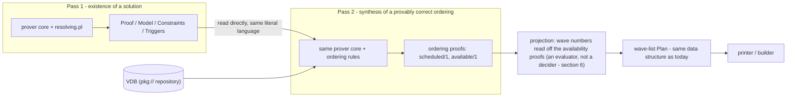
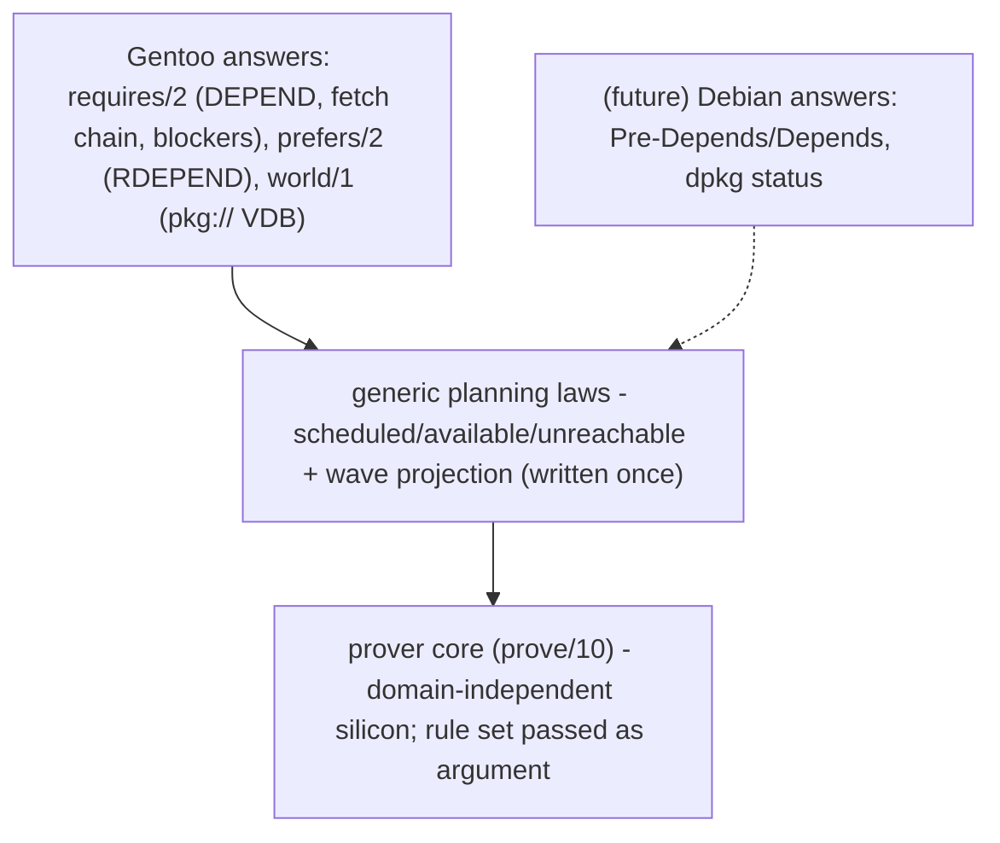
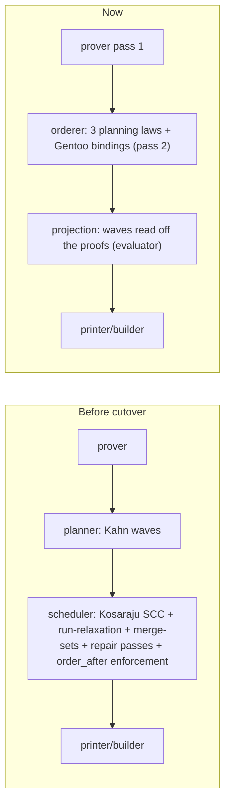

# The Ordering Engine: Plans as Proofs

**Status:** IMPLEMENTED (2026-08-01). The engine described here is the
production orderer (`Source/Pipeline/orderer.pl` +
`Source/Domain/Gentoo/Rules/ordering.pl`); the classic planner/scheduler were
deleted after a whole-tree A/B comparison showed identical action multisets
and identical runtime. Passages below written in the present tense about
"today's" planner/scheduler describe the pre-cutover implementation and are
kept as design motivation.
**Post-cutover naming refactor:** after the cutover the prover was made
rule-set agnostic — `prover:prove(Rules, ...)` (arity 10) takes the rule
module as an explicit argument, replacing the guarded dispatch clause and
per-thread flag described in §4.3 and the FAQ. `rules.pl` became
`resolving.pl` (pass 1), `ordering.pl` hosts the planning laws + Gentoo
bindings (pass 2), and thin stage wrappers pair prover with rule set:
`resolver.pl` (`resolver:resolve/9` → `prover:prove(resolving, ...)`) and
`orderer.pl` (`orderer:order/5` → `prover:prove_once(ordering, ...)`).
**Scope:** replaces the procedural planner/scheduler with a second proving
pass over the existing prover core
**Companion:** the implementation and validation steps lived in the working
plan (`ordering_rules_engine` plan); this document contains only the design.

---

## 0. The helicopter view

portage-ng answers two questions for every request. *What* must exist —
which packages, versions, USE flags — is answered by the prover, a stable
logical engine whose Gentoo knowledge is loaded from rules like microcode.
*When* each step happens is answered, today, by something entirely
different in kind: a procedural planner and scheduler running graph
algorithms (Kahn's waves, Kosaraju SCC condensation, relaxation tiers,
repair passes) over the prover's output. The first answer comes with a
proof; the second comes with "the algorithm said so".

This design gives the second question the same treatment as the first:
**run the same prover a second time.** Pass 1 proves a solution exists —
unchanged, all choice lives there. Pass 2 orders that solution using a
handful of generic planning laws — *a step can be placed once everything
it requires is available; a thing is available if an earlier plan step
provides it, or if the installed system already does* — plus one Gentoo
bindings file that answers three questions by reading the pass-1 proof and
the VDB: what does this step require (build-time deps), what would we like
early without insisting (runtime deps, as preferences), and what does the
system already have (installed packages).

Cycles stop being a special case. When a dependency loop closes, "an
earlier plan step provides it" fails — the step in question is the one we
are still working on — so the next clause asks whether the *world as it
stands* provides it. An installed python bridges the python→tk→fontconfig
loop with a citation of the VDB entry, which is exactly how Linux From
Scratch reasons about its temporary toolchain: a fact about the present
system, not a heuristic about graphs. On a machine where nothing bridges
the loop, the plan reports an honest `unreachable` assumption — the
genuine bootstrap boundary — instead of an arbitrary cut.

The payoff is threefold. Every placement in the plan carries a
human-readable justification ("fontconfig can be built at step 8 because
python-3.14.6 is already installed; the new python is built at step 12").
Ordering quirks become rule edits instead of engine surgery — the same
split that already keeps Gentoo semantics out of the prover core. And the
graph machinery is deleted outright: Kahn as semantics, SCC condensation,
relaxation tiers, repair passes, and the ordering markers smuggled through
proof contexts all go, while the printer and builder receive the same
wave-list plan as before and never notice the revolution upstream.

Reading guide: §1 motivates; §2 gives the two-pass architecture; §3 cleans
the pass-1 proof format pass 2 depends on; §4 states the laws, the Gentoo
bindings, and how both sit on the real prover core; §5–§7 work the
mechanics (reading requirements from the proof, deriving order, cycles);
§8 retires the leaked artifacts; §9–§10 cover variants, deletions, and
performance; §11 records the design decisions as Q&A.

---

## 1. Why

portage-ng has an elegant prover. Given a target, it proves what must be
true for that target to exist: which packages, which versions, which USE
flags, which slots. The proof is inspectable, and every fact in it has a
justification.

But a proof is not a plan. To execute anything we must order the actions in
time, and today that ordering is produced by machinery *outside* the logic:

- `planner.pl` runs Kahn's algorithm over the proof to build "waves";
- `scheduler.pl` handles what Kahn cannot (cycles) with Kosaraju SCC
  condensation, progressive `:run`-edge relaxation, merge-set post-passes,
  ordering-violation repair, and longest-path wave reassignment.

This machinery works — we build more than 90% of the Portage tree — but it
has three structural problems:

1. **Correctness became empirical.** The prover guarantees the *what*; the
   *when* is the output of graph algorithms whose correctness is checked by
   "does it build?". When a package lands in the wrong wave (issue #114:
   `python[tk]` co-waved with the `tk` it needs at build time), diagnosing
   it means archaeology across five procedural passes.

2. **We respin the silicon weekly.** Think of the prover as a CPU core:
   stable for years, millions of proofs. The scheduling algorithms are
   implemented *on the die next to it*, so every ordering quirk in the tree
   means patching engine code rather than editing rules. Compare: Gentoo
   domain knowledge lives in `resolving.pl` — microcode loaded from disk — and
   when Gentoo semantics change we edit rules, never the core. Placement
   logic never got that treatment.

3. **The output stopped being explainable.** Gentoo descends from Linux
   From Scratch: a book that explains *why* each step comes next ("you can
   build this now because you already have a host compiler"). Our plans are
   correct, but their justification is "the condensation's longest path said
   so" — a sentence no human wants to read.

The redesign makes the plan itself a *proof object*: the same prover core,
run a second time with a small set of ordering rules loaded like any other
microcode, constructs the ordering rather than certifying one built
elsewhere. Every placement in the plan then has a proof, and the proof reads
like the LFS sentence.

---

## 2. The architecture: two proving passes

Pass 1 answers a question about the **final world**: does a consistent
solution exist? It is the existing prover with the existing domain rules,
completely unchanged. All *choice* lives here (versions, USE, OR-groups).

Pass 2 does not re-prove the solution, and it does not answer a yes/no
question — pass 1's success already implies, for all practical purposes,
that an ordering exists. Pass 2 **constructs** one: it derives a provably
correct ordering of the solution's steps, and its output is not a verdict
but the ordering proof itself. This is plan synthesis in the deductive
tradition (extract the program from the constructive proof): the proof of
`scheduled(A)` *is* A's placement justification, and the plan is read off
the proof. Pass 2 receives a *ground* problem — every literal concrete,
every choice made — and its rules never mention versions, USE flags, or
alternatives; only steps and time.



Key properties:

- **The prover core is untouched.** `prove/9` and its four registers
  (Proof, Model, Constraints, Triggers) stay exactly as they are. (The
  post-cutover refactor later widened the signature to `prove/10` — the
  extra argument is the rule module — but the four registers and the
  search behaviour are unchanged.) The plan
  is *not* a fifth register: ordering facts accumulate in the pass-2 model,
  and the numbered wave list is a projection computed downstream — the same
  status printer output has. (Wave numbers are deliberately kept out of the
  model: relations are monotone under change, numbers are not; keeping
  numbers out preserves memoization and incremental reproving.)

- **Pass 2 reads pass-1 output directly.** No extraction step, no copied
  fact base. The pass-1 Model alone is insufficient — it is flat truth and
  forgets who required what — so pass 2 reads Proof + Model together through
  view predicates (section 4). One source of truth; nothing to drift.

- **Failure is the exception, and it is informative.** Because pass 1 has
  already established the solution, pass-2 synthesis is expected to succeed;
  the interesting output is the ordering and its justifications, not the
  success. The rare exception — a requirement neither a plan step nor the
  installed world can provide — is the genuine bootstrap case, reported as
  its own negative assumption (`unreachable/2`), distinct from pass-1
  existence failures. Today these two conditions come out tangled in one
  assumption pile.

---

## 3. Prerequisite: a clean pass-1 proof

Before pass 2 can exist, pass 1's output must be honest. Today, ordering
and planner information is smeared across the proof in four places. Three
of them are leaks — downstream machinery's working state hiding in the
proof format — and must go. The fourth is legitimate and is the foundation
pass 2 builds on.

**The three leaks:**

1. **`dep(Count, Body)` proof values.** Every proof entry today is
   `rule(Head) ==> dep(48, [...])?Ctx`. The `48` is not part of the proof —
   it was meant as Kahn's in-degree counter, but verification against the
   source shows the wave planner never reads it: `prover:canon_rule/3`
   discards the count (`dep(_, B)`) and the planner recomputes its own via
   `planner:calculate_action_dependencies/2`. The `dep(-1, ...)` "assumed"
   sentinel is equally dead — cycle-break detection keys on
   `assumed(rule(...))` proof keys, never the `-1`. The counter is pure
   dead weight even today. Cleaned format: `rule(Head) ==> Body?Ctx`. No
   counter. (Cutover caveat: the unit tests assert exact `dep(N, Body)`
   shapes and must be rewritten with the format.)

2. **`after(Lit)` / `after_only(Lit)` markers inside `?{Context}`.** Rules
   that need ordering today smuggle it through the proof context — and the
   two markers turn out to have different fates. Plain `after/1` (world
   register `resolving.pl:275`, world unregister `resolving.pl:241`, download and
   dependency chains in `target.pl`, reinstall re-emission) is read back
   by the emitting rules themselves and planted as an **ordinary body
   dependency** — its ordering content already lives in the proof body,
   where pass 2 looks; the marker is a redundant transport. `after_only/1`
   (PDEPEND obligations, emitted from `heuristic.pl` and `dependency.pl`)
   is the one that becomes a pseudo-constraint (leak 3). The codebase
   files both under a `featureterm.pl` section literally titled
   *"Planning-only ordering markers"*; the scrubber that section offers,
   `strip_planning/2`, is dead code — zero call sites, and it never
   handled `after_only/1` anyway. Cleaned format: contexts carry proving
   parameters only (`self/1`, `build_with_use/1`, slot info, ...). No
   `after/1`, no `after_only/1`. One caution: `after_only/1` is *also*
   read by pass-1 conflict logic (`cnselect:is_pdepend_failure/2`
   suppresses parent narrowing for PDEPEND deps), so retiring the marker
   changes prover behaviour, not just planning — the replacement must
   preserve that signal.

3. **`constraint(order_after(Anchor))` body entries.** The `after_only/1`
   channel in a second disguise: `featureterm:add_after_condition`
   converts those markers (and only those — plain `after/1` takes the
   body-dependency branch) into these pseudo-constraints, which the
   scheduler then obeys in a dedicated post-pass. Cleaned format: gone
   entirely (section 8 shows what replaces them).

**What legitimately remains — and is the whole point:** the rule structure
itself. `rule(geneweb:install, [..., ocaml:install dep, ...])` *is*
ordering information — "to install geneweb you need ocaml installed" — but
it is not smeared: it is the explicit, declarative content of the proof,
with the temporal kind carried by the action name. This works because the
unification of Gentoo's five dependency variables already happened at the
parser boundary: DEPEND, RDEPEND, PDEPEND, BDEPEND exist only inside
`eapi.pl`, which normalizes them into dependency literals over **action
literals**. From a real `app-misc/geneweb:run` proof:

```prolog
% DEPEND became:  geneweb's install step needs ocaml's install
grouped_package_dependency(no,'dev-lang',ocaml,
  [package_dependency(install, ...)]):install

% RDEPEND became: geneweb's run state needs calendars' run state
grouped_package_dependency(no,'dev-ml',calendars,
  [package_dependency(run, ...)]):run
```

*Needing something to `:install` means needing it before your build step;
needing something to `:run` means needing it in the finished world.* The
action name is the temporal kind. That is why pass 2 needs no vocabulary of
its own (an early draft introduced a STRIPS-style `precondition/effect`
layer and was rejected for exactly this reason): pass 2 is written over the
same `Repository://Entry:Action` literals as pass 1.

The full language inventory of the system is therefore:

1. Ebuild metadata (DEPEND/RDEPEND/...) — parser boundary only, as today.
2. Action literals `Repo://E:Action` — shared by pass 1 **and** pass 2.
3. Two pass-2 judgment wrappers *about* those literals: `scheduled/1` and
   `available/1`.

**Before / after, on the real geneweb entry:**

```prolog
% TODAY (planner counter in the value, markers possible in contexts):
rule(portage://'app-misc/geneweb':install) ==>
  dep(48, [constraint(use(...)), ...,
           grouped_package_dependency(...ocaml...):install?{...}]) ? []

% CLEAN (the proof is only the proof):
rule(portage://'app-misc/geneweb':install) ==>
  [constraint(use(...)), ...,
   grouped_package_dependency(...ocaml...):install?{...}] ? []
```

---

## 4. The grammar

### 4.1 Generic planning laws (domain-independent, written once)

Planning is not Gentoo-specific — Debian, RPM, and every other package
domain orders steps, bridges with an installed world, and hits cycles. The
*laws* live once, in the pipeline layer, and own no terms: `A` and `D` are
whatever literals the domain's proofs contain.

```prolog
% A step can be placed once everything it requires is available:
rule(scheduled(A), Conds) :-
  findall(available(D), requires(A, D), Conds).

% Available = an earlier plan step provides it. The guard makes a cyclic
% request FAIL here and fall through to the world clause — on the actual
% prover core this guard is load-bearing, not decorative (section 4.3):
rule(available(D), [scheduled(D)]) :-
  \+ prover:currently_proving(scheduled(D)).

% ...or the world as it stands already provides it:
rule(available(D), []) :- world(D).

% ...or neither: record the bootstrap failure as a negative domain
% assumption instead of failing the pass (section 7):
rule(available(D), [assumed(unreachable(D))]).
rule(assumed(unreachable(_)), []).
```

Three laws, one guard, one fallback. Everything else in this document is a
consequence of them. (The fallback follows the established domain-assumption
idiom — `rule(assumed(X), [])` — so `unreachable` lands in the pass-2 proof
as an ordinary negative domain assumption; the *pair* form shown in section
7's report is recovered from the proof, whose `scheduled(A)` node contains
the failed `available(D)`.)

Notice that the laws *use* three predicates they do not *define*:
`requires/2`, `world/1`, and (consulted only by the wave projection, see
section 10) `prefers/2`. That is deliberate: the laws state how planning
works anywhere; a domain answers, in its own terms, three concrete
questions.

### 4.2 What Gentoo must answer (the domain file)

`Domain/Gentoo/Rules/ordering.pl` is nothing more than the Gentoo answers to
those three questions:

**Question 1 — "What does this step require?"** (`requires/2`)
Answered by reading the pass-1 proof; section 5 shows exactly how. Two
examples of what the answers look like:

```prolog
requires(portage://'app-misc/geneweb-7.1_beta-r1':install,
         portage://'dev-lang/ocaml-4.14.2':install).     % from DEPEND
requires(portage://'app-misc/geneweb-7.1_beta-r1':install,
         portage://'app-misc/geneweb-7.1_beta-r1':download). % fetch before build
```

Only *hard* needs become requirements. In Gentoo that means: build-time
deps (DEPEND/BDEPEND), the fetch-before-build chain within one ebuild, and
blockers (the unmerge of a conflicting package is required before the
install that conflicts with it).

**Question 2 — "What would we like early, without insisting?"**
(`prefers/2`)
Runtime deps (RDEPEND). A program does not need its runtime libraries to
be *compiled*, only to be *run* — so they create no requirement. But a
good plan still merges libraries before the programs that use them, so
runtime deps become preferences the projection honors whenever no hard
requirement stands in the way (section 10 explains why this replaces
today's relaxation tiers). PDEPEND is the explicit "fine to do later"
case: no requirement, and even the preference is reversed.

**Question 3 — "What does the system already have?"** (`world/1`)
Answered by the VDB, which is already a repository in the knowledge base
(`pkg://` entries) — but honesty requires noting that as a *query pattern*
this is new. Pass 1 never emits `pkg://` literals into proofs: installed
packages short-circuit through `candidate:grouped_dep_keep_installed/5`,
which resolves the grouped dep with an *empty body*. `world/1` is
therefore a fresh, simple query over existing data: resolve the active VDB
through `knowledgebase:vdb_repository/1` (never the literal `pkg` atom —
client mode imports it as `pkg@<host>`), and check the requirement's
version constraint against the installed version with the existing
machinery (`cnselect:installed_entry_satisfies_package_deps/5`,
`preference:version_match/3`). The proof cites the VDB entry.

A future `Domain/Debian/ordering.pl` would answer the same three questions
from Debian's terms — Pre-Depends and Depends for question 1 and 2, the
dpkg status database for question 3 — including the genuinely different
Debian fact that Depends *does* order the configure step.



### 4.3 Grounding the laws on the actual core (verified against source)

The laws above are written to run on the prover core *as it exists*. Four
facts about that core shape their exact form:

**Dispatch.** *(As designed:* the prover called `rule(Full, Body)`
unqualified, resolving to one process-wide `rule/2` binding, and pass 2 was
to swap the rule source with a guarded dispatch clause keyed on a
per-thread flag — the same idiom as the synthetic test-rule store's
`test_rules_active` guard.*)* The post-cutover refactor replaced that
idiom with an explicit rule-source parameter: `prover:prove(Rules, ...)`
(arity 10) scopes the rule module for the pass, and every expansion goes
through `prover:rule_call/2`, which calls `Rules:rule/2` directly
(`config:default_rules/1` supplies the module for callers outside any
pass). Note also that `prover:prove/10` is not a bare proof call: it wraps
the goal in `with_reprove_state`, firing
`heuristic:init_state`/`cleanup_state` and resetting the learned-constraint
store. The pass-2 driver bypasses that lifecycle by calling the inner
entry point, `prover:prove_once(ordering, ...)`.

**Literal shapes.** `scheduled(...)`/`available(...)` pass through
`prover:canon_literal/3` as plain literals — no `:action` suffix or context
wrapping needed; proof keys become `rule(scheduled(...))`, squarely inside
the existing key language. One head-matching caveat: the prover hands the
*un-stripped* literal to `rule/2`, so a goal may arrive as
`scheduled(A)?{Ctx}`; the law heads must match both shapes (the test
store's normalizing idiom, `( L = Core?{_} -> true ; Core = L )`).

**Backtracking, and why the guard is load-bearing.** Multiple `rule/2`
clauses for one head are backtracking alternatives — clause order
implements "prefer step over world" — but only when the first clause
*fails cleanly*. On the unmodified core, a cyclic `scheduled(D)` request
never fails: the cycle branch (`prover.pl:868-912`) always **succeeds**,
either as a benign cycle or as a cycle-break assumption
(`assumed(rule(...))`). And Gentoo's `heuristic:cycle_benign/2` patterns
match dependency-literal shapes and `_:run` entries — never a
`scheduled(...)` wrapper — so without the guard, every pass-2 cycle would
be classified structural and would succeed as a cycle-break marker: the
very mechanism section 5 retires, silently reinstated. The guard reads
the prover's cycle stack (`prover:currently_proving/1`, a documented
primitive) and makes the step clause fail cleanly into the world clause.
It is one honest reach into a prover primitive, and it is the price of
keeping the core untouched; the alternative — a per-pass cycle-policy hook
in the core — was considered and rejected because it edits the silicon
this design promises not to edit.

**Failure does not memoize.** Only successes land in the Model (there is
no negative memoization), so a failing subtree re-derives its failure for
every parent that retries it. The guard doubles as the fail-fast fix, and
the terminal case converts into the recorded `unreachable` assumption —
which, being a success, memoizes like any other model entry.

One residual: the `heuristic:` hook namespace (`cycle_benign/2`,
`ctx_equivalent/2`, `should_union_ctx/1`, `proof_obligation/4`, the state
lifecycle) is shared between passes and fires with pass-1 semantics during
a pass-2 run. Today's `ctx_sem_key` behaviour — collapsing every context
without USE terms into one equivalence class — is actually *useful* for
pass 2 (each `scheduled(A)` is derived once regardless of which parent
requests it), but that is luck, not design: when `ordering.pl` lands, each
hook's behaviour on the pass-2 literal shapes must be enumerated and either
made pass-aware or documented as correct-by-default.

---

## 5. How `requires/2` reads the pass-1 proof

This section answers one question: given the (cleaned) pass-1 proof, how do
we know what a step requires? The answer is a two-step lookup, shown here
on a real `app-misc/geneweb:run` proof.

**Step 1 — look up the step's own proof entry.** Its body lists what pass 1
needed to prove it:

```prolog
rule(portage://'app-misc/geneweb-7.1_beta-r1':install) ==>
  [ constraint(use(...)), ...,                                   % choices — skip
    portage://'app-misc/geneweb-7.1_beta-r1':download?{...},     % a) direct
    grouped_package_dependency(no,'dev-lang',ocaml,[...]):install?{...},  % b) dep
    grouped_package_dependency(no,'dev-ml',calendars,[...]):run?{...},    % c) dep
    ... ]
```

Three kinds of entry. The `constraint(...)` entries record pass-1 choices
(which version, which USE flags) — they say nothing about time and are
skipped. Entry (a) is a direct requirement in plain sight: geneweb's
install needs geneweb's download. Entries (b) and (c) are dependency
literals — they say *what* is needed (`ocaml`, needed to `:install`;
`calendars`, needed to `:run`) but not yet *which concrete package* was
chosen to provide it.

**Step 2 — look up the dependency literal's own proof entry.** Every
dependency literal from step 1 is itself a proof key, and *its* body names
the provider pass 1 chose:

```prolog
rule(grouped_package_dependency(no,'dev-lang',ocaml,[...]):install) ==>
  [ constraint(selected_cn('dev-lang',ocaml): ...),
    portage://'dev-lang/ocaml-4.14.2':install?{...} ]    % <-- the chosen provider
```

Putting the two lookups together:

```prolog
requires(portage://'app-misc/geneweb-7.1_beta-r1':install,
         portage://'dev-lang/ocaml-4.14.2':install).
```

That is the entire `requires/2` implementation: two lookups in data the
proof already contains. Nothing is recomputed, nothing is copied, and no
separate dependency-resolution machinery exists at ordering time. (The
current scheduler maintains exactly such machinery to rebuild this
information after the fact; it is retired, see section 10.) Two mechanical
details of the lookups: body literals retain their `?{Ctx}` while proof
keys are stored context-stripped, so each hop normalizes through
`prover:canon_literal/3` — the same normalization the classic planner
performs today — and the view relies on the proof holding exactly one
entry per canonical dependency literal (the prover's overwrite branch
guarantees last-derivation-wins).

Entry (c) — the `:run` dependency — takes the other branch from section
4.2: it becomes a *preference*, `prefers(geneweb:install,
calendars:install)`, via the same two lookups.

Three proof-key families need no lookup at all: domain assumptions
(`rule(assumed(...))` — pass 1 found no provider, so there is nothing to
require; they flow to the report unchanged), `cycle_path(...)` diagnostics,
and bookkeeping markers (`obligation_done(...)` — invisible to the
ordering as such, though they are the proof's only machine-readable record
of PDEPEND provenance, which the PDEPEND ordering rules may reuse — the
gantt grapher already reconstructs PDEPEND edges from them). Prover
cycle-break markers
(`assumed(rule(Lit))`) remain a pass-1 device for terminating its own proof
search, but pass 2 no longer consumes them as ordering input: it
re-encounters the same loop through `requires/2` and resolves it with a
justification instead of a marker (section 7).

**Provenance.** A pass-2 proof node records which pass-1 node created each
requirement:

```prolog
rule(scheduled(portage://'app-misc/geneweb-7.1_beta-r1':install)) ==>
  [ available(portage://'dev-lang/ocaml-4.14.2':install), ... ]
    ? [via(rule(grouped_package_dependency(no,'dev-lang',ocaml,[...]):install))]
```

"Why is ocaml before geneweb?" is answered by one proof node whose context
points at the exact pass-1 node that created the requirement.

---

## 6. Everything is derived, nothing is stated

The design deliberately has **no ordering primitive**. There is no
`before/2` fact, no edge, no graph vocabulary anywhere in the semantics.

**Ordering is derived.** Step B precedes step A exactly when A's proof of
`available(D)` went via `scheduled(B)`. The projection walks the
availability proofs and assigns each action the least wave consistent with
them — Kahn's algorithm survives only as one possible *evaluation strategy*
for that least fixpoint, with the same semantic status unification has in
SLD resolution: the algorithm implements the logic and has no authority of
its own.

**"Isn't the projection just an algorithm again?"** Yes — and that is
fine, because it has been demoted. Today's planner and scheduler *are* the
definition of the ordering: there is nothing independent to check them
against, which is how correctness became empirical (section 1). The
projection, by contrast, evaluates a function the proofs already define —
one equation, *a step's wave is one more than the latest wave among the
providers its availability proofs cite* (steps whose requirements were all
world-provided land in wave 1) — so any implementation is interchangeable
and, more importantly, **auditable**: given the proofs, checking a
projection's output is a single pass — every cited provider sits in a
strictly earlier wave. The projection's only genuine freedom is *which*
proof-permitted layout to choose, and `prefers/2` merely biases that
choice; it can never force or forbid a placement (section 10). The
"wave-list Plan", finally, is not an algorithm at all: it is the output
*data structure* — the same list of waves the printer and builder consume
today (section 10 gives its exact contract). The claim was never "no
algorithms anywhere"; it is that no algorithm carries semantic authority.

Note also what the projection does *not* do: it does not add parallelism.
Two steps may share a wave exactly when neither's availability cone cites
the other — concurrency is the *absence* of a dependency proof, the state
the proofs leave open by default. The projection merely refrains from
destroying it (section 11, "Why project waves downstream...").

**Worked example.** For geneweb (nothing relevant installed):

```text
wave 1   ocaml:download        geneweb:download      dune:download ...
wave 2   ocaml:install                               ...
wave 3   dune:install          camlp5:install        ...
wave 4   geneweb:install
```

`geneweb:install` sits in wave 4 because its proof of
`available(ocaml:install)` used `scheduled(ocaml:install)` (wave 2), of
`available(dune:install)` used wave 3, and of
`available(geneweb:download)` used wave 1. The wave number is arithmetic
over facts you can read.

**Runtime deps create no obligations — only preferences.** `geneweb:run`
needing `calendars:run` is not a step requirement: `:run` describes the
finished world, and pass 1 already proved the finished world consistent. It
becomes a `prefers/2` fact instead, honored by the projection when nothing
hard conflicts (section 10). Because a preference can never *force* an
ordering, runtime-only cycles cannot form, and today's "relax RDEPEND edges
inside cycles" machinery has nothing left to relax.

---

## 7. Cycles: the world as a proof

The deepest change. Consider issue #114's cycle:

```text
python:update  --DEPEND-->  tk:install  --DEPEND-->  fontconfig:install
      ^                                                    |
      +--------------------DEPEND--------------------------+
```

Today, three different components each do part of the job: the prover
plants a cycle-break marker at whatever point of the loop its search
happens to reach first, the planner refuses to schedule anything the
marker touches, and the scheduler then reassembles and linearizes the
leftovers. Where the cycle gets cut is an accident of search order, and no
part of the output explains *why* the cut is safe.

In this design a cycle is never represented, cut, or repaired — the guard
merely notices "I am already working on that step" and declines to promise
it a second time. Watch what the laws do with the loop above, step by
step:

1. To place `python:update`, we need `tk:install` available.
2. To place `tk:install`, we need `fontconfig:install` available.
3. To place `fontconfig:install`, we need `python:install` available.
   Can an earlier plan step provide it? No — the only python step in the
   plan is the very `python:update` we started with, and it is still *on
   the prover's cycle stack*: the step clause's guard
   (`\+ prover:currently_proving(scheduled(D))`, section 4.1) fails the
   clause cleanly. This clean failure is the whole trick — without the
   guard the core's cycle branch would *succeed* with a cycle-break
   assumption and the next clause would never be consulted (section 4.3).
   So the second clause asks: does the *system as it stands* provide it?
   The VDB says `python-3.14.6` is installed, and it satisfies the version
   constraint of fontconfig's dependency. **Yes — proven from the world,
   citing the VDB entry.**
4. Now everything unwinds: `fontconfig:install` is schedulable (step 8,
   say), then `tk:install`, then `python:update` (step 12).

The plan orders itself, and the proof of step 3 reads exactly like the
Linux From Scratch justification:

> *fontconfig can be built at step 8 because python-3.14.6 is already
> installed on this system; the new python is built at step 12.*

That is the same reasoning LFS uses for its temporary toolchain ("you
already have a host compiler") — a fact about the present system, not a
heuristic about graphs. Note what we did *not* do: we never represented
the cycle, never chose an edge to cut, never ran a strongly-connected-
components pass. The machinery that does all that today exists to
approximate, after the fact and globally, what the world-clause just
proved locally with a citation.

**The bootstrap case.** Now imagine the same three packages on an empty
machine — no python in the VDB. Step 3 changes: no plan step provides
`python:install` (guard fails the step clause), and the world does not
either (VDB lookup fails). The fallback clause fires, recording
`rule(assumed(unreachable(python:install)))` in the pass-2 proof — the
established domain-assumption idiom, so the pass *completes* rather than
failing, and the report pairs the assumption with its requiring step read
off the proof:

```prolog
unreachable(fontconfig:install, python:install)
```

In words: *"fontconfig needs python at build time, no step of this plan
can provide it in time, and the system does not currently have it."* That
is an honest, actionable statement — it is LFS's own boundary (without a
host system you cannot bootstrap; Gentoo's answer is the stage3 tarball, a
pre-materialized world). It surfaces as its own assumption class, distinct
from pass-1 existence failures.

**Determinism note.** When a requirement is satisfiable both by a plan step
and by the world, or when either of two cycle edges could be bridged, a
declarative tie-break preference (prefer step over world; prefer bridging
runtime-flavoured requirements first) makes plans canonical. These
preferences are quality bias, never correctness.

---

## 8. Retiring the leaked artifacts: what replaces what

Section 3 named three leaks. Here is, concretely, how each case works
today and how the same behaviour is produced after the change.

**Case 1: "this step, but only after that one."**

Two markers carry this sentence today, and verification against the source
shows they take different routes — one of which is already clean.

*The `after/1` route — already proof-shaped.* `resolving.pl` line 275 emits
the world registration with the marker in its proof context —

```prolog
world(Arg):register?{[after(Repository://Ebuild:run)]}
```

— but the world rule itself (`resolving.pl:293-295`) reads the marker straight
back and plants `Repository://Ebuild:run` as an **ordinary member of the
rule body**. The ordering content already lives exactly where pass 2 looks
— in the proof body — so `requires/2` inherits the world-file ordering
with no special handling at all. The marker is a redundant transport
between two clauses of the same file; it is simply dropped, and nothing
replaces it. (Same for the other `after/1` emitters: world unregister,
download chains, reinstall re-emission.)

*The `after_only/1` route — the genuine three-file relay.* PDEPEND
obligations (`heuristic.pl:669` on the production hook path,
`dependency.pl:214` on the multi-pass path) emit `after_only(Anchor)`;
`featureterm:add_after_condition` converts it into a pseudo-constraint in
the proof body —

```prolog
constraint(order_after(Anchor):{[]})
```

— and finally `scheduler:enforce_order_after_constraints` walks the
finished plan and moves the step until it sits after its anchor. Three
mechanisms, in three files, to say one sentence.

*After*: the sentence is said once, as an ordinary rule in `ordering.pl`:

```prolog
requires(Step, Anchor) :- pdepend_obligation(Step, Anchor).
```

The step is then placed after its anchor for the same reason everything
else is placed anywhere: its availability proof used `scheduled(Anchor)`.
No context marker, no pseudo-constraint, no plan post-pass —
`add_after_condition` and `enforce_order_after_constraints` are deleted at
cutover because the things they manage no longer exist, and
`strip_planning/2` can be deleted *today*: it has no call sites left and
never handled `after_only/1` anyway. One caution from section 3 bears
repeating: `after_only/1` is also read by pass-1 conflict logic
(`cnselect:is_pdepend_failure/2`), so the marker's retirement must
preserve that signal on the prover side.

**Case 2: the `dep(Count, ...)` counter.**

*Today*: the prover pre-computes, for every proof entry, how many body
entries it has — `dep(48, [...])` — and then nobody reads it: the planner
discards the count (`prover:canon_rule/3` matches `dep(_, B)`) and
recomputes its own in-degrees, and cycle-break detection keys on
`assumed(rule(...))`, never on the `-1` sentinel. The number means nothing
to the proof and, it turns out, nothing to the planner either.

*After*: the proof value is just the body, `[...]?Ctx`. Nothing counts
down because nothing runs Kahn: readiness is the `scheduled/1` proof. The
special value `dep(-1, ...)` (an "assumed" flag) also disappears — the
proof *key* `assumed(rule(...))` already carries that information. (The
unit tests that assert exact `dep(N, Body)` shapes are rewritten with the
format.)

**Migration (completed).** These artifacts could not be deleted on day
one, because the classic planner/scheduler needed them while it remained
the production engine. During the A/B phase the new engine read the
classic format through small compatibility views (an `order_after`
constraint is read as a `requires/2` fact; the count in `dep(Count, Body)`
is simply ignored). The classic engine has since been deleted at cutover;
the compatibility views remain (they are the bindings' way of reading the
pass-1 proof), and the two target invariants are the end state for any
future pass-1 format cleanup:

- **Pass 1 emits no temporal information.** Dependency literals carry
  action kinds only; every temporal meaning lives in `ordering.pl`.
- **Proof values carry no planner bookkeeping.**

---

## 9. Variants

A plan is a property of a *model*. When variant mode explores
`os -> || (linux darwin)`, pass 1 produces two worlds, and each gets its own
pass-2 run — the same multiplicity as today, where planner+scheduler also
run per variant proof.

The mitigation is sharing, and it is why relations (not wave numbers) live
in the model: a `scheduled/available` sub-proof between actions outside the
variants' differing cone is the *same theorem* in both variants
(requirements and VDB do not vary with the branch choice). One honesty
note: no cross-run memoization mechanism exists today — the Model is
per-prove-call state. The hook is there (the prover accepts a non-empty
`InProof`/`InModel`; the pipeline merely passes empty AVLs), so a later
variant's pass-2 run *can* be seeded from an earlier one, but the seeding
semantics — precisely which entries are variant-cone-independent — must be
specified before the optimization is enabled, because sharing a sub-proof
*inside* the differing cone would be unsound. Until then, sharing is a
designed-for future optimization, not a property of the prototype. Only
the differing cone and its boundary — requirements satisfied by steps
inside the cone, world availabilities whose provider is the OR-choice
itself — genuinely need per-variant proving. Wave numbers are per-variant
projection output.

---

## 10. What gets deleted, what remains



Retired: Kahn's algorithm as semantics, Kosaraju/SCC condensation,
progressive `:run` relaxation, merge-set post-passes, ordering-violation
repair and its iteration caps, the scheduler's internal dep-to-provider
reconstruction (`PkgHeadMap`), `order_after` enforcement, prover
cycle-break markers as plan inputs, `dep/2` counts.

Remaining: the prover core (unchanged, now run twice), the generic
planning laws, one domain bindings file, and a projection small enough to
barely deserve a module. The wave-list Plan structure, printer, and builder
are unchanged — the revolution is invisible downstream of the projection.

For that invisibility to hold, the projection's output contract is precise:
today's Plan is a list of waves of **full-format pass-1 rule terms**, not
bare literals. So for each `scheduled(A)` proved in pass 2, the projection
fetches A's rule from the pass-1 proof (`prover:rule_from_proof/3`) and
places that term in its computed wave: heads keep their `?{Ctx}` (the
builder reads `replaces/1` out of head contexts), bodies come along (the
printer's update/downgrade suppression inspects them), and the whole plan
stays a plain serializable term (`--resume` writes it to disk). Two
invariants and one retained post-pass complete the contract:

- **Membership:** every pass-1 action appears exactly once in the projected
  plan — including unreachable ones, with a defined rendering. (This is
  what made "both engines produce the same package set" checkable rather
  than hoped-for — and checked: during the A/B phase,
  `orderer:test_compare/1` and `orderer:test_compare_latest/1` ran both
  engines on a shared pass-1 proof for every repository entry and failed
  any entry whose plans disagreed on the action multiset. The whole-tree
  run came back with zero mismatches, which is what authorized the
  cutover; the comparison harness was deleted along with the classic
  engine it compared against. Wave shapes were deliberately not compared;
  the engines legitimately differed in density.)
- **Downstream arguments:** the printer receives an `SCCs` value; the
  projection supplies `[]`, exactly as the scheduler's no-remainder fast
  path did.
- **Within-wave order:** `orderer:merge_order_bias` — the Portage-parity
  refcount ordering *within* a wave, inherited from the classic scheduler —
  is engine-agnostic (Plan + Triggers in, Plan out) and is retained as a
  projection post-pass; it orders presentation inside a wave and never
  moves anything across waves, so it cannot violate an availability proof.

### What happens to progressive relaxation

Today's pipeline *over-constrains and then backs off*. The wave planner
treats **every** dependency — including runtime deps — as a hard ordering
constraint. In the common acyclic case that is fine (it produces the
emerge-like "libraries before programs" order). But it also means runtime
deps can *close* cycles that build deps alone would not, so the scheduler
must progressively relax: inside each cyclic component it drops `:run`
edges, re-checks, drops more if needed — tiers of retreat from a position
that was never justified in the first place.

The new design never takes that position, so there is nothing to retreat
from. Each dependency is born with its true strength:

- Build-time needs are **requirements** — they must be satisfied, by a
  step or by the world, or the plan honestly fails (`unreachable/2`).
- Runtime needs are **preferences** (`prefers/2`) — the wave projection
  consults them and places a preferred provider before its consumer
  whenever no requirement or earlier placement stands in the way. When
  preferences conflict (the cyclic case), some are simply not honored —
  silently and safely, because a preference was never a promise.

The observable behaviour matches today's end state — runtime deps order
the acyclic bulk of the plan, and stop mattering exactly where cycles made
them impossible to honor — but it is reached in one pass, by construction,
with no tiers, no re-checking, and no machinery that first asserts a
constraint and later takes it back. Hard is born hard; soft is born soft.

**Disambiguation: pass-1 relaxation stays.** The word "relaxation" names
two unrelated mechanisms today. The pipeline's 5-tier fallback chain
(strict → keyword_acceptance → blockers → unmask → keyword_unmask) is
*pass-1* relaxation: it loosens which candidate worlds are admissible
under masks, keywords, and licenses — a question about the existence of a
solution, mapping to actionable user advice. That is genuine domain policy
and is untouched by this design. Only the scheduler's ordering relaxation
— backing off constraints the pipeline itself had over-asserted —
disappears. In short: **pass 1 relaxes what worlds are acceptable; pass 2
never relaxes anything.**

Performance expectations: pass 2 is a ground problem sized like the proof —
near-linear rule application with only *shallow* choice points (each
`available/1` goal carries the step-versus-world alternative, and the world
clause is a cheap ground test; the guard makes the cyclic case fail fast
rather than search). Successful `scheduled/available` derivations memoize
through the prover's proven fast path — each distinct literal is derived
once per pass; failures do not memoize, which is exactly why the terminal
case records an `unreachable` assumption instead of failing (section 4.3).
Views are lazily evaluated or memoized per run (pure performance choice).
If interpreted rules prove hot, the existing `goal_expansion` machinery
(`query.pl` precedent) compiles the stable microcode down to the hot path
without touching its semantics.

---

## 11. Design decisions (recorded Q&A)

- **Why two passes instead of one enriched judgment?** Existence and
  ordering are different logics: pass 1 reasons about a final world and
  owns all choice; pass 2 reasons about time over ground facts. Fusing them
  makes every rule speak both languages and multiplies backtracking.
  Sequencing gives pass 2 a ground problem and keeps both rule sets
  single-minded. (An optional propose-verify-refine loop can feed pass-2
  failures back as learned constraints — the store already exists.)

- **Why is pass 2 synthesis, not a decision problem?** Pass 1 already
  proves a solution exists, so "can it be planned?" is (almost always)
  implicitly answered before pass 2 begins. Asking pass 2 to prove
  plannability would be re-proving what we know. Its actual job is to
  *construct* the ordering with its correctness proof attached — the proof
  of `scheduled(A)` is A's placement justification, and the plan is
  extracted from the proof, not certified after the fact. `unreachable/2`
  is an exceptional discovery (bootstrap), not the question being asked.

- **Why is the plan not a fifth prover register?** The four registers are
  generic logical artifacts. Ordering facts fit the existing model/proof;
  the numbered wave list is presentation, computed downstream, recomputable
  at will. Also: relations are monotone and memoizable; wave numbers are
  volatile and would poison incremental reproving.

- **Why project waves downstream instead of letting the rules derive them?
  Isn't that parallelism bolted on as an afterthought?** The intuition is
  inverted: the projection does not *add* parallelism, it *preserves* it.
  The rules derive the dependency relation; concurrency is that relation's
  complement — two steps may run together exactly when neither's
  availability cone cites the other. Absence of a proof is not derivable
  content, so no rule could "put together" a wave; a wave is defined by
  what the rules are silent about. What would be bolted on is the
  opposite: a total order, which invents tie-breaks between steps no proof
  relates. Rules *could* compute numbers (`W is 1 + max(...)` is legal
  Prolog), but a wave number is a global, non-monotone fact — adding one
  unrelated package shifts every downstream number — so numeric theorems
  would be invalidated by changes that never touch their subject, wrecking
  pass-2 memoization and cross-variant sharing, and their proofs would be
  max-plus arithmetic instead of the LFS sentence. Waves are also just one
  presentation of the partial order (the builder's; the printer, the
  grapher, and `prefers/2` want others), and some readout pass must exist
  regardless — theorems in an AVL must become the builder's serialized
  term. The design makes that unavoidable pass trivial and auditable
  rather than semantic. If anything, *today's* pipeline is the bolted-on
  one: waves there are an algorithm's working state (Kahn's counters),
  repaired after the fact. Here the relation is the semantics and the
  wave plan is a readout.

- **Why isn't a wave itself a citizen that decides whether to accept an
  action?** Because the acceptance judgment already exists as a
  *definition*, and promoting it to a *negotiation* buys nothing while
  reviving two things this design deletes. The definition: wave *n*
  accepts A iff every provider A's availability proofs cite sits in a wave
  before *n* — the projection's equation read right-to-left, and exactly
  the one-pass audit from section 6. Now watch what an agent-wave would
  need: to rule on A it consults A's providers' placements — information
  owned entirely by the proofs and by *other* actions' placement. The wave
  contributes nothing but its index; an entity that decides using only
  others' data is a facade over a lookup, not a citizen. (Contrast
  repositories, genuine citizens of the OO context: they own state and
  behavior over it. A wave owns nothing — it is an equivalence class
  induced by the dependency relation; every fact "about wave 3" is a fact
  about actions in costume.) Refusal is the tell: a protocol must say what
  happens when a wave declines — try the next wave, which is
  `max(providers)+1` re-enacted as a conversation; and a protocol where
  actions are presented and possibly bounced is stateful and
  order-of-presentation sensitive — Kahn's ready-queue reborn as an actor,
  refusal-handling as the repair pass reborn as etiquette. Meanwhile
  `accepts(wave3, A)` is the same global, non-monotone fact as
  `wave(A, 3)`; sharding it across per-wave citizens does not restore
  locality. Where acceptance *is* a real question — runtime capacity
  ("can I start another job?") — it belongs to the builder, at execution
  time, which already treats wave boundaries as parallelism barriers and
  re-sorts within them. The checking form of acceptance survives as the
  audit; the deciding form was never needed.

- **Why no STRIPS/planning vocabulary?** It re-expresses domain content in
  a third language. The action literals already encode temporal meaning;
  the generic laws quantify over the domain's own sentences instead of
  translating them.

- **Why are the planning laws not Gentoo-specific?** Because every package
  domain shares them (Debian, RPM). The laws own no terms; domains bind
  `requires/2` and `world/1`. Same split as prover core vs `resolving.pl`.

- **Why is cycle handling not a special mechanism?** Because "the world
  already provides it" is just the second way to prove availability. The
  data is the same VDB pass 1 consults (via keep-installed), though the
  query pattern is new — pass 1 short-circuits with empty bodies and never
  emits `pkg://` literals (section 4.2). Genuinely unbridgeable
  requirements are negative assumptions, not engine failures.

- **Why does the step clause carry a guard instead of the core learning to
  fail cycles?** Because the unmodified core *never* fails a cyclic goal —
  it succeeds benignly or plants a cycle-break assumption — and the
  world-bridge only works if the step clause fails cleanly. The choice was
  between one domain-rule reach into a documented prover primitive
  (`prover:currently_proving/1`) and a new cycle-policy hook in the core.
  The guard wins: it keeps the silicon untouched, it is honest about what
  it does, and it doubles as the fail-fast fix for the prover's lack of
  negative memoization (section 4.3).

- **Why a guarded dispatch clause instead of a rule-source parameter in
  `prove/9`?** *(Decision reversed post-cutover.)* At design time, threading
  a rule module through `prove/9` and its recursive helpers was a core
  signature change — exactly what this design promised to avoid — while the
  guarded-first-clause idiom was already load-bearing for the synthetic
  test-rule store, so the cutover shipped with the guarded dispatch clause
  keyed on a per-thread flag. Once the planner/scheduler were gone and the
  two-pass symmetry became the architecture rather than an experiment, the
  hidden thread state was the *less* honest option: the rule set is now an
  explicit argument (`prover:prove(Rules, ...)`, arity 10), the resolver
  passes `resolving`, the orderer passes `ordering`, and the dispatch
  clause was deleted.

- **Why is there no relaxation?** Relaxation exists today because the
  planner first asserts runtime deps as hard constraints and the scheduler
  must then walk that back inside cycles. Here every dependency is born
  with its true strength — requirements (build) versus preferences
  (runtime) — and a preference that cannot be honored is simply not
  honored. Nothing is asserted that later needs taking back.
