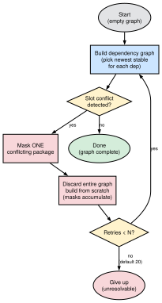
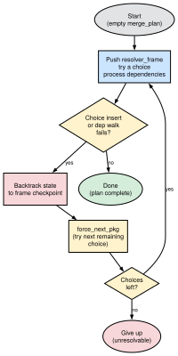
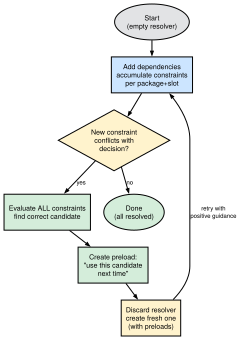
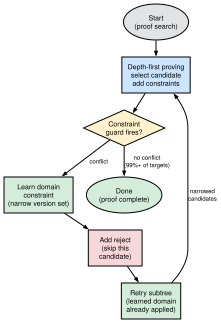

# Dependency Resolver Comparison

## Architecture Overview

All four resolvers solve the same problem: given a set of requested
packages, figure out which concrete versions to install and in what
order.  Where they differ is in how they handle **conflicts** —
situations where the first choice turns out to be wrong.

Each subsection below describes the resolver’s strategy and
illustrates its conflict-resolution loop.


### Portage (Python)

Portage takes the most straightforward approach.  It builds a
dependency graph by walking every dependency and picking the newest
stable candidate for each.  If two packages end up claiming the same
slot, Portage detects the conflict after the graph is already built.

Its recovery strategy is blunt: mask the conflicting package so it
won’t be picked again, throw away the entire graph, and rebuild it
from scratch.  Each retry adds one more mask.  The masks accumulate
across retries, but no other information carries over — the graph
starts clean every time.  Portage allows up to 20 retries by default
(configurable with `--backtrack=N`).

{width=40%}

Because each retry rebuilds everything, this approach is the slowest
of the four.  Complex dependency tangles — like the OCaml Jane Street
ecosystem — can require more than a dozen retries before Portage finds
a consistent graph.


### pkgcore (Python)

pkgcore’s `pmerge` resolver is also Python, but it does **not** copy
Portage’s rebuild-with-masks loop.  Resolution is a depth-first walk
over an explicit **frame stack** (`resolver_stack` /
`resolver_frame` in `pkgcore.resolver.plan`): each atom pushes a
frame, tries a choice, and walks that choice’s dependency set.

When a choice fails — inserting it into the plan state fails, or a
dependency under it cannot be satisfied — pkgcore **backtracks to the
frame’s checkpoint** (`state.backtrack(start_point)`), advances to the
next remaining package for that atom (`force_next_pkg`), and continues
inside the same `merge_plan`.  Failed alternatives can also be pruned
from the choice set (`reduce_solutions`).  There is no global mask
list carried into a fresh graph, and no Paludis-style preload that
names the winning candidate for the next full restart.

{width=40%}

Relative to Portage, this is a real improvement: work already done
above the failing frame is kept, and only the open choice point is
revisited.  Relative to Paludis and portage-ng, the guidance is still
mostly **negative and local** — “try the next candidate” — rather than
a positively learned domain or a computed “use this package next
time.”  Deep, blocked search spaces can still explore a large fraction
of the choice tree (and historically could blow the Python recursion
limit before the frame rewrite moved the stack out of the call stack).


### Paludis (C++)

Paludis is smarter about what it remembers.  Instead of masking wrong
candidates, it identifies the **right** one.  When a new constraint
conflicts with an earlier decision, Paludis evaluates all accumulated
constraints for that package simultaneously and determines which
candidate satisfies them all.

It then records a *preload* — an instruction that says “use this
specific candidate next time.”  The resolver is discarded and a fresh
one is created, but the preloads travel with it.  This means the next
attempt starts with positive guidance rather than just a list of things
to avoid.

{width=40%}

Because Paludis carries forward the right answer instead of just
rejecting the wrong one, it typically needs fewer restarts than
Portage.  However, each restart still creates a brand-new resolver,
so the dependency walk itself is repeated.


### portage-ng (SWI-Prolog)

portage-ng avoids the restart-from-scratch pattern altogether.  It
uses a depth-first proof search: each dependency becomes a proof
obligation, and selecting a candidate adds constraints to a global
store.  Constraint guards monitor the store and fire immediately when
a conflict appears.

When a guard fires, three things happen in sequence:

1. The conflicting domain is **learned** — the version set for that
   package is narrowed to exclude impossible choices.
2. The current candidate is **rejected** so it won’t be tried again.
3. Only the affected **subtree is retried**, with the learned domain
   already in place to guide candidate selection.

{width=40%}

For the vast majority of packages (over 99%), no conflict arises at
all and the proof completes in a single pass.  When conflicts do
occur, the combination of learned domains (positive guidance) and
rejects (negative filtering) resolves them without rebuilding the
entire proof tree.  This makes portage-ng the fastest of the four
resolvers.


## Comparison Table

| **Aspect** | **Portage** | **pkgcore** | **Paludis** | **portage-ng** |
| :--- | :--- | :--- | :--- | :--- |
| Language | Python | Python | C++ | SWI-Prolog |
| Conflict detection | Post-hoc (after graph built) | Incremental (during frame / choice walk) | Incremental (on constraint add) | Incremental (constraint guard) |
| What carries across retries | Masks (negative) | Remaining choices in the frame (negative pruning) | Preloads (positive) | Learned domains (positive) + Rejects (negative) |
| Fresh state each retry? | Yes (new depgraph) | No — backtrack to frame checkpoint | Yes (new Resolver) | Partial (reject set accumulates, learned store accumulates) |
| Finding the right candidate | Brute force (mask+retry) | `force_next_pkg` after backtrack | `_try_to_find_decision_for` with ALL constraints | Domain narrowing (Zeller) + priority resolution (Vermeir) |
| Performance | Slowest (full rebuild) | Faster than Portage (keeps parent frames) | Fast (targeted restarts) | Fastest (single-pass for most targets) |
| Package-specific code | None | None | None | None |

## Slot Allocation: Pigeonhole Reasoning

Gentoo slots turn part of dependency resolution into an allocation
problem: every selected version occupies exactly one hole — its
(package, slot) pair — no hole may host two occupants, and different
holes of the same package may legitimately coexist (`gcc:12` next to
`gcc:13`).  pkgcore names this structure literally: its slot tracker
is a class called
[`PigeonHoledSlots`](https://github.com/pkgcore/pkgcore/blob/master/src/pkgcore/resolver/pigeonholes.py).
Constraint-programming solvers such as the Glasgow Constraint Solver
use the pigeonhole *principle* as a first-class reasoning device.
All three systems compared below enforce the same invariant, but at
three different strengths: pkgcore **detects** a collision when it
happens, CP propagators **preclude** whole families of collisions
before search branches, and portage-ng **detects and learns from**
each collision.  (Portage sits before all three: as described above,
it notices two packages claiming the same slot only after the graph
is fully built, then masks and rebuilds.)

### pkgcore: the hole as an occupancy table

`PigeonHoledSlots` is a mutable registry consulted by `merge_plan`
during its frame-stack walk.  A dictionary keyed by package maps to
the current occupants; `fill_slotting(obj)` scans for an existing
occupant with the same slot and, on a hit, returns the conflicting
objects instead of inserting.  Blockers reuse the same structure as
*limiters* — anti-pigeons registered per key via `add_limiter`, which
poison the hole against any matching occupant.  On a returned
conflict the resolver backtracks to the frame checkpoint and advances
to the next candidate.

The name is the metaphor, not the mathematical principle.  Detection
is eager but **pairwise**: a conflict is noticed only when the second
pigeon arrives at the hole.  The knowledge gained is **negative and
local**: the colliding objects are reported, the choice list is
pruned, and nothing narrows future candidate selection.

### Constraint programming: the hole as a counting argument

In CP solvers the pigeonhole principle appears as the propagation
semantics of global constraints such as `allDifferent`: "these five
jobs have only four time slots between them, so by a pigeonhole
argument the problem is infeasible."  Régin's matching-based
propagator (AAAI 1994) and Puget's Hall-interval bounds consistency
detect that k variables collectively reach fewer than k values in
polynomial time, *before* the search tree branches.  This counting
argument is exactly where resolution-based SAT solvers struggle —
pigeonhole formulas require exponential resolution proofs (Haken
1985) — which is why the CP community treats `allDifferent`
propagation, and the Glasgow Constraint Solver's proof-logging work
certifying it, as a genuinely different reasoning class rather than
an implementation detail.

### portage-ng: the hole as a feature dimension

portage-ng has neither an occupancy table nor a cardinality
propagator.  Slot allocation emerges from three mechanisms of the
proof search:

**Slots are a dimension of the version domain.**  Every
`version_domain(Slots, Bounds)` carries a slot set next to its
version bounds, and `domain_meet` intersects both dimensions at once
(Chapter 10).  Two requirements on the same package whose slot sets
are disjoint meet to `slots([])`, which is structurally inconsistent
— the proof fails *before any candidate is enumerated*:

```prolog
version_domain:meet_slot_domains(slots(S1), slots(S2), slots(S)) :-
  ord_intersection(S1, S2, S).

version_domain:domain_inconsistent(version_domain(slots([]), _Bounds)).
```

This is a small pigeonhole-style cut in the CP spirit — infeasibility
derived by set algebra rather than by attempting an insertion —
though unary (per package), not a cross-package counting argument.

**Occupancy is a constraint guard, not a table.**  The counterpart of
`fill_slotting` is the `selected_cn(C,N)` ordset accumulated in the
constraint store; `cnselect:selected_cn_unique_or_reprove/4` enforces
at most one concrete entry per (C,N) — or per (C,N,slot) hole where
multislot coexistence applies — each time feature unification merges
a new selection into the store.

**A collision is converted into knowledge.**  Where pkgcore returns
the colliding objects, the portage-ng guard *learns*: it stores a
narrowed `cn_domain(C,N,Slot)` via `prover:learn/3`, rejects the
conflicting candidate, and re-proves only the affected subtree with
the narrowed domain already applied to candidate selection.  If the
conflict survives all retries it is memoized (`memo:slot_conflict_/3`)
and surfaces as a `slot_conflict` domain assumption — a negative,
blocking outcome — rather than a silent failure.  Blockers get the
same treatment as pkgcore's limiters conceptually, but are tracked as
constraints with source snapshots and degrade to actionable blocker
assumptions.

### Why portage-ng skips cardinality propagation

portage-ng does not perform Glasgow-style cross-package counting: a
hypothetical "five packages competing for four holes" is discovered
through the collide–learn–retry loop, not refuted up front by a
matching argument.  The Gentoo domain almost never presents that
structure.  Slots are scoped per package — `gcc:12` and `gcc:13` are
holes belonging to `sys-devel/gcc` alone, never a pool that unrelated
packages compete for — so the `allDifferent` pattern (many variables
drawing from one shared value set) essentially does not arise.  The
hole structure is also *ragged*: which slot a candidate occupies is
metadata of the chosen version, so the pigeon determines its own
hole; and sub-slot (`:=`) rebuilds make occupancy dynamic, beyond
static allocation entirely.  What the domain actually needs is
per-package unary domains with slot as a feature dimension, pairwise
consistency for slot operators, and good conflict recovery — which is
precisely the narrowing-plus-learning design described above.

| **Aspect** | **pkgcore** | **CP (Glasgow-style)** | **portage-ng** |
| :--- | :--- | :--- | :--- |
| Pigeonhole meaning | Occupancy table (metaphor) | Counting principle (Hall sets, matching) | Guard invariant + slot-set algebra |
| Detection moment | Insertion of second occupant | Before branching (propagation) | Constraint merge / guard evaluation |
| Knowledge from a conflict | List of colliding objects | Pruned domains, certified cuts | Learned `cn_domain` + reject set |
| Recovery | Backtrack, next candidate | Pruned before search (else backjump) | Re-prove subtree with narrowed domain |
| Cross-package counting | No | Yes | No (domain rarely needs it) |

See [Chapter 10](10-doc-version-domains.md) for the domain algebra and
[Chapter 9](09-doc-prover-assumptions.md) for the learning and reprove
mechanics used above.

## Academic Foundations

### Zeller & Snelting: Feature Logic (ESEC 1995, TOSEM 1997)

"Handling Version Sets through Feature Logic" (ESEC 1995, LNCS 989) and its
expanded journal version "Unified Versioning Through Feature Logic" (TOSEM
1997, Vol. 6 No. 4) — version sets are identified by feature terms and
configured by incrementally narrowing the set until each component resolves
to a single version. portage-ng's `version_domain` with `domain_meet`
(intersection) is essentially Zeller's feature term narrowing. The learned
constraint store implements Zeller's feature implication propagation:
constraints discovered in one proof attempt propagate to narrow version
sets in the next attempt.

### Vermeir & Van Nieuwenborgh: Ordered Logic Programs (JELIA 2002)

"Preferred Answer Sets for Ordered Logic Programs" — when rules conflict,
a partial order determines which yields. portage-ng's `find_adjustable_origin`
implements this: when a domain is inconsistent (two bounds that can't be
simultaneously satisfied), the bound from the "adjustable" origin (the
package that already has a learned constraint) is dropped, and the origin
is narrowed further.

### CDCL / PubGrub / SAT-based approaches

Modern package resolvers (libsolv, Resolvo, PubGrub) encode version
constraints as boolean satisfiability problems. portage-ng's approach is
different: it uses proof search with domain narrowing rather than SAT
encoding. The learned constraint store is analogous to CDCL's learned
clauses, but expressed as version domains rather than boolean clauses.

### Any-of (`||`) arm preference

Portage’s `dep_zapdeps` `choice_bins` and portage-ng’s
`ranking:prioritize_deps_keep_all/3` multi-key sort are compared in
detail in [Chapter 12, Any-of (`||`) arm selection](12-doc-resolution.md#any-of-arm-selection)
(including why overlapping-`||` DNF, virtual expand, and circular
demotion inside `||` are not mirrored as ranking keys).
