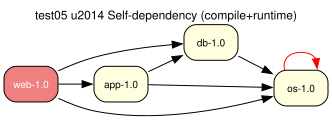

# test05 — Self-dependency (compile + runtime)

**Category:** Cycle

This test case combines test03 and test04. The 'os-1.0' package lists itself as
both a compile-time and runtime dependency, creating two self-referential cycles.
The runtime leg dissolves via the install/run action split (running os only
requires os to be installed); the compile-time leg is broken with a single
benign prover cycle-break assumption on os:install.

**Expected:** The prover should produce a plan with all four packages. One benign
cycle-break assumption on os:install is expected for the compile-time leg; the
runtime leg needs no assumption. Emerge handles the same case silently.



<details>
<summary><b>emerge</b></summary>

```
These are the packages that would be merged, in order:

Calculating dependencies  ... done!
Dependency resolution took 1.21 s (backtrack: 1/20).


[ebuild  N     ] test05/web-1.0::overlay  0 KiB
[ebuild  N     ]  test05/app-1.0::overlay  0 KiB
[ebuild  N     ]   test05/db-1.0::overlay  0 KiB
[ebuild  N     ]    test05/os-1.0::overlay  0 KiB

Total: 4 packages (4 new), Size of downloads: 0 KiB

 * Error: circular dependencies:

(test05/os-1.0:0/0::overlay, ebuild scheduled for merge) depends on
 (test05/os-1.0:0/0::overlay, ebuild scheduled for merge) (buildtime)

 * Note that circular dependencies can often be avoided by temporarily
 * disabling USE flags that trigger optional dependencies.
```

</details>

<details>
<summary><b>portage-ng</b></summary>

```

>>> Emerging : overlay://test05/web-1.0:run?{[]}

These are the packages that would be merged, in order:

Calculating dependencies... done!

 └─step  1─┤ download  overlay://test05/web-1.0
             │ download  overlay://test05/os-1.0
             │ download  overlay://test05/db-1.0
             │ download  overlay://test05/app-1.0

 └─step  2─┤ install   overlay://test05/os-1.0

 └─step  3─┤ install   overlay://test05/db-1.0

 └─step  4─┤ run       overlay://test05/db-1.0

 └─step  5─┤ install   overlay://test05/app-1.0

 └─step  6─┤ run       overlay://test05/app-1.0

 └─step  7─┤ install   overlay://test05/web-1.0

 └─step  8─┤ run     overlay://test05/web-1.0

Total: 11 actions (4 downloads, 4 installs, 3 runs), grouped into 8 steps.
       0.00 Kb to be downloaded.


```

</details>