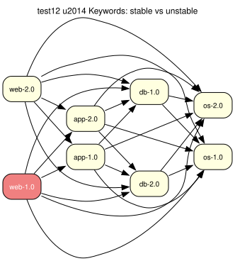

# test12 — Stable vs unstable keyword acceptance

**Category:** Keywords

This test case examines the prover's handling of package keywords and stability. The latest (2.0) versions of the packages are marked as unstable. Without a specific configuration to accept these unstable keywords, the package manager should not select them.

**Expected:** Version selection follows the active ACCEPT_KEYWORDS. With a stable-only configuration the prover should reject the 2.0 versions and resolve the dependencies using the stable 1.0 versions (app-1.0, db-1.0, os-1.0). With ~arch accepted (e.g. the fallback developer profile used when no /etc/portage is present) the unstable 2.0 versions are legitimately selected instead; the test expectation checks the active keyword acceptance and validates the matching outcome.



<details>
<summary><b>emerge</b></summary>

```
These are the packages that would be merged, in order:

Calculating dependencies  ... done!
Dependency resolution took 0.75 s (backtrack: 0/20).

[ebuild  N     ] test12/os-2.0::overlay  0 KiB
[ebuild  N     ] test12/db-2.0::overlay  0 KiB
[ebuild  N     ] test12/app-2.0::overlay  0 KiB
[ebuild  N     ] test12/web-2.0::overlay  0 KiB

Total: 4 packages (4 new), Size of downloads: 0 KiB
```

</details>

<details>
<summary><b>portage-ng</b></summary>

```

>>> Emerging : overlay://test12/web-1.0:run?{[]}

These are the packages that would be merged, in order:

Calculating dependencies... done!

 └─step  1─┤ download  overlay://test12/web-1.0
             │ download  overlay://test12/os-2.0
             │ download  overlay://test12/db-2.0
             │ download  overlay://test12/app-2.0

 └─step  2─┤ install   overlay://test12/os-2.0

 └─step  3─┤ run       overlay://test12/os-2.0

 └─step  4─┤ install   overlay://test12/db-2.0

 └─step  5─┤ run       overlay://test12/db-2.0

 └─step  6─┤ install   overlay://test12/app-2.0

 └─step  7─┤ run       overlay://test12/app-2.0

 └─step  8─┤ install   overlay://test12/web-1.0

 └─step  9─┤ run     overlay://test12/web-1.0

Total: 12 actions (4 downloads, 4 installs, 4 runs), grouped into 9 steps.
       0.00 Kb to be downloaded.


```

</details>