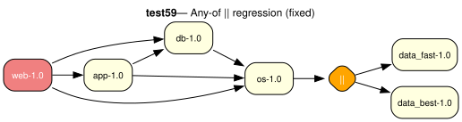

# test59 — Any-of || selection regression (fixed)

**Category:** Regression

This is a regression test for a (now fixed) bug where the any-of group (||) did
not force the solver to select at least one alternative. Structurally similar to
test21 (any-of in RDEPEND), but this test uses different package names and exists
specifically to guard against any-of members all being dropped from the model.

**Expected:** The solver must select one alternative from the any-of group: the model
should contain either data_fast-1.0 or data_best-1.0.



<details>
<summary><b>emerge</b></summary>

```
These are the packages that would be merged, in order:

Calculating dependencies  ... done!
Dependency resolution took 0.74 s (backtrack: 0/20).

[ebuild  N     ] test59/data_fast-1.0::overlay  0 KiB
[ebuild  N     ] test59/os-1.0::overlay  0 KiB
[ebuild  N     ] test59/db-1.0::overlay  0 KiB
[ebuild  N     ] test59/app-1.0::overlay  0 KiB
[ebuild  N     ] test59/web-1.0::overlay  0 KiB

Total: 5 packages (5 new), Size of downloads: 0 KiB
```

</details>

<details>
<summary><b>portage-ng</b></summary>

```

>>> Emerging : overlay://test59/web-1.0:run?{[]}

These are the packages that would be merged, in order:

Calculating dependencies... done!

 └─step  1─┤ download  overlay://test59/web-1.0
             │ download  overlay://test59/os-1.0
             │ download  overlay://test59/db-1.0
             │ download  overlay://test59/data_fast-1.0
             │ download  overlay://test59/app-1.0

 └─step  2─┤ install   overlay://test59/os-1.0
             │ install   overlay://test59/data_fast-1.0

 └─step  3─┤ run       overlay://test59/data_fast-1.0

 └─step  4─┤ run       overlay://test59/os-1.0

 └─step  5─┤ install   overlay://test59/db-1.0

 └─step  6─┤ run       overlay://test59/db-1.0

 └─step  7─┤ install   overlay://test59/app-1.0

 └─step  8─┤ run       overlay://test59/app-1.0

 └─step  9─┤ install   overlay://test59/web-1.0

 └─step 10─┤ run     overlay://test59/web-1.0

Total: 15 actions (5 downloads, 5 installs, 5 runs), grouped into 10 steps.
       0.00 Kb to be downloaded.


```

</details>