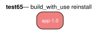

# test65 — build_with_use reinstall semantics

**Category:** Installed

This test case is a regression test for use:installed_entry_satisfies_build_with_use/2,
the check the rebuild paths key on (the resolving:rule install/run short-circuit and
candidate:update_requires_use_rebuild). It finds an installed VDB entry with an
IUSE flag that was disabled at build time and verifies the check in both
directions. Flags outside a package's IUSE are ignored by design (they cannot
influence the build), so a synthetic always-false flag cannot trigger a mismatch.

**Expected:** For an installed entry with a disabled IUSE flag, the satisfies-check
must accept the entry when no bracketed USE is requested, and reject it when the
disabled flag is required via build_with_use. End-to-end bracketed-USE rebuilds
are covered by test51 and test76. Requires a populated pkg (VDB) repository; the
batch runner skips this case on hosts without one (e.g. CI).



<details>
<summary><b>emerge</b></summary>

```
These are the packages that would be merged, in order:

Calculating dependencies  ... done!
Dependency resolution took 0.76 s (backtrack: 0/20).

[ebuild  N     ] test65/app-1.0::overlay  0 KiB

Total: 1 package (1 new), Size of downloads: 0 KiB
```

</details>

<details>
<summary><b>portage-ng</b></summary>

```

>>> Emerging : overlay://test65/app-1.0:run?{[]}

These are the packages that would be merged, in order:

Calculating dependencies... done!

 └─step  1─┤ download  overlay://test65/app-1.0

 └─step  2─┤ install   overlay://test65/app-1.0

 └─step  3─┤ run     overlay://test65/app-1.0

Total: 3 actions (1 download, 1 install, 1 run), grouped into 3 steps.
       0.00 Kb to be downloaded.


```

</details>