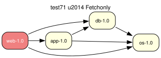

# test71 — Fetchonly as a filter on the `:run` plan

**Category:** Fetchonly

`--fetchonly` / `-f` (and `--fetch-all-uri` / `-F`) is **not a second proof**.
Portage's `emerge -f` works the same way: it resolves the merge plan, then
restricts what is printed and executed.

portage-ng proves `target:run` with the same 5-tier fallback as `--merge`.
`preference:local_flag(fetchonly)` then:

- **printer** — shows downloads and configuration pre-actions (unmask /
  keyword / USE / license) only; install / run / update / downgrade /
  reinstall are hidden
- **builder** — executes only those remaining actions
- **world** — is not written, even on a real (non-pretend) run

`-F` is the same filter, plus `ebuild:distfile_scope/1` (`preference` vs
`all` SRC_URI). That scope is already orthogonal to the proof.

The overlay fixture is the same four-package graph as test01. The case
proves `:run` (so the model still contains install/run). The test harness
sets the fetchonly flag only while printing, so the transcript below is
the filtered plan a user sees with `--fetchonly`.

**Expected:** The proof is a normal `:run` closure (web, app, db, os). The
printed plan lists four downloads and no install/run steps.



<details>
<summary><b>emerge</b></summary>

```
These are the packages that would be fetched, in order:

Calculating dependencies  ... done!
Dependency resolution took 0.75 s (backtrack: 0/20).
```

</details>

<details>
<summary><b>portage-ng</b></summary>

```

>>> Emerging : overlay://test71/web-1.0:run?{[]}

These are the packages that would be merged, in order:

Calculating dependencies... done!

 └─step  1─┤ download  overlay://test71/web-1.0
             │ download  overlay://test71/os-1.0
             │ download  overlay://test71/db-1.0
             │ download  overlay://test71/app-1.0

Total: 4 actions (4 downloads), grouped into 1 step.
       0.00 Kb to be downloaded.


```

</details>