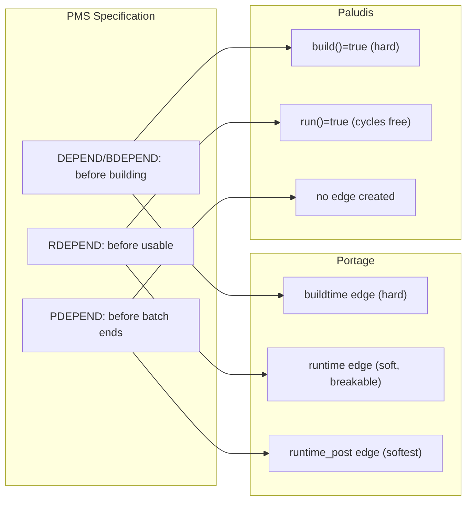
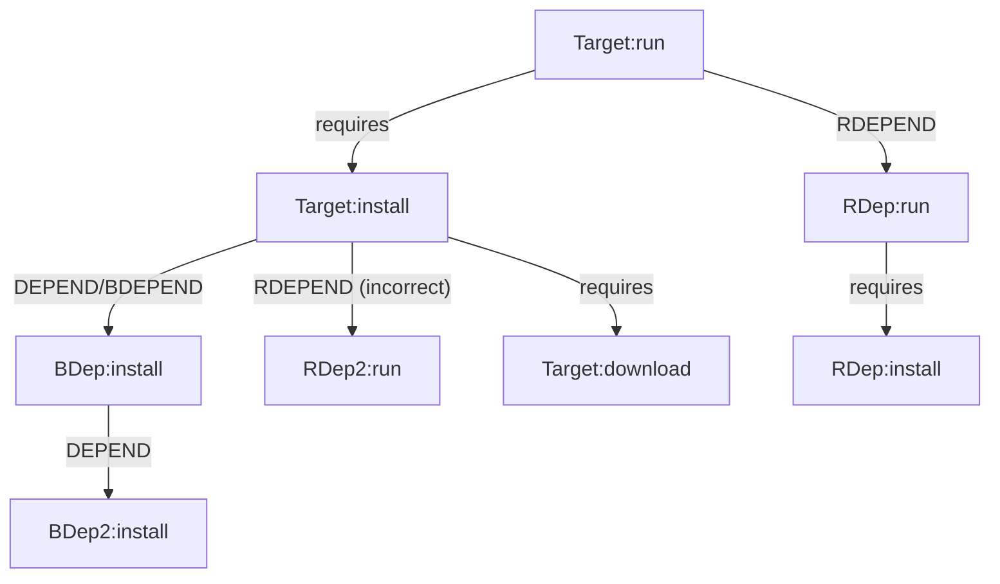
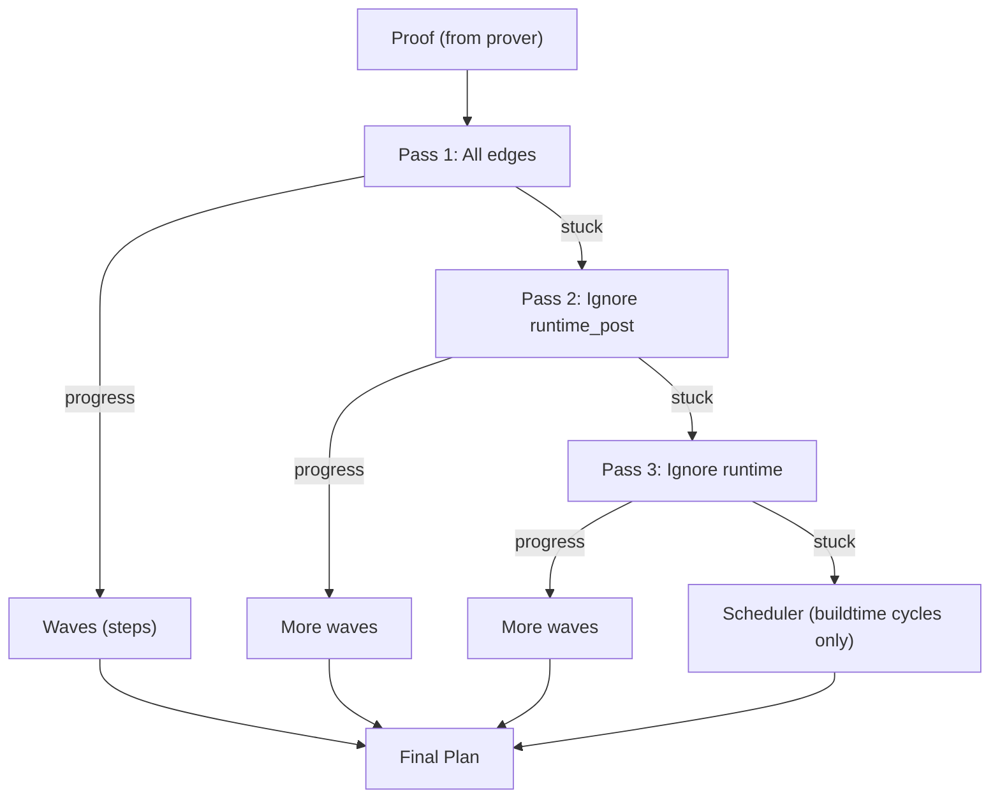

# Dependency Ordering: PMS, Portage, Paludis, and portage-ng

This document describes how Gentoo's dependency types affect package merge
ordering, comparing the PMS specification with the implementations in
Portage, Paludis, and portage-ng.

## Dependency Types (PMS Chapter 8)

The Package Manager Specification defines five dependency classes:

| Type | PMS Definition | When required | Binary compat |
|---|---|---|---|
| DEPEND | Build dependencies | Before `pkg_setup` and throughout `src_*` phases | CHOST |
| BDEPEND | Build dependencies (EAPI 7+) | Same as DEPEND | CBUILD |
| RDEPEND | Runtime dependencies | Before the package is treated as usable | CHOST |
| PDEPEND | Post dependencies | Before the package manager finishes the batch | CHOST |
| IDEPEND | Install-time dependencies (EAPI 8+) | During `pkg_preinst` and `pkg_postinst` | CBUILD |

### Phase functions and dependency availability

| Phase functions | Available dependency classes |
|---|---|
| `src_unpack`, `src_prepare`, `src_configure`, `src_compile`, `src_test`, `src_install` | DEPEND, BDEPEND |
| `pkg_preinst`, `pkg_postinst`, `pkg_prerm`, `pkg_postrm` | RDEPEND, IDEPEND |
| `pkg_config` | RDEPEND, PDEPEND |

### Ordering implications

- **DEPEND/BDEPEND**: "Must be installed and usable before `pkg_setup`."
  These create **hard ordering constraints** -- the dependency must be merged
  before the dependent can be built. Neither Portage nor Paludis will break
  these edges for cycle resolution.

- **RDEPEND**: "Must be installed and usable before the results of an ebuild
  merging are treated as usable." This is a **soft ordering constraint** --
  ideally the dependency is merged before the dependent, but both Portage and
  Paludis will break these edges when cycles exist.

- **PDEPEND**: "Must be installed at some point before the package manager
  finishes the batch of installs." This is the **softest constraint** --
  Portage treats it as a very low priority edge, and Paludis creates no
  ordering edge at all.

- **IDEPEND**: Available during install-time phases. Treated similarly to
  runtime dependencies for ordering purposes.

## Portage Implementation

Source: `lib/_emerge/depgraph.py`, `lib/_emerge/DepPriority.py`,
`lib/_emerge/DepPriorityNormalRange.py`

### Edge priority system

Portage builds a single dependency graph where every package is a node and
every dependency creates a directed edge. Edges carry a priority that
determines how "hard" they are:

| Dependency | Priority flag | Priority value | Breakable? |
|---|---|---|---|
| DEPEND/BDEPEND | `buildtime=True` | -1 | No (hard) |
| RDEPEND (`:=` slot op) | `runtime_slot_op=True` | -2 | Only if cross-compiling |
| RDEPEND | `runtime=True` | -3 | Yes (for cycles) |
| PDEPEND | `runtime_post=True` | -4 | Yes (first to break) |
| Optional | `optional=True` | -5 | Yes (always breakable) |

### Cycle-breaking algorithm

Portage's `_serialize_tasks` method performs topological sort with
progressive edge relaxation:

```
Pass 1: Respect all edges (NONE priority)
Pass 2: Ignore optional dependencies (SOFT)
Pass 3: Ignore PDEPEND edges (MEDIUM_SOFT)
Pass 4: Ignore RDEPEND edges (MEDIUM)
         (except runtime_slot_op, unless cross-compiling)
```

If no leaf nodes are found after all passes, the remaining cycle involves
only build-time dependencies and is treated as an error or merged as a
group.

### RDEPEND handling

RDEPEND creates ordering edges: Portage tries to merge runtime dependencies
before their dependents. However, when cycles exist, RDEPEND edges are
broken before build-time edges. This means:

- In the common (acyclic) case: RDEPEND is satisfied before the dependent
- In cyclic cases: RDEPEND may be merged after the dependent

### PDEPEND handling

PDEPEND creates `runtime_post` edges with very low priority. Portage adds
PDEPEND nodes to an `asap_nodes` list to merge them as early as possible
after the dependent, but the ordering constraint is very weak.

## Paludis Implementation

Source: `paludis/resolver/orderer.cc`, `paludis/resolver/labels_classifier.cc`

### NAG (Node-Adjacency Graph)

Paludis builds a NAG where edges carry two boolean flags:

```cpp
NAGEdgeProperties {
    build()        // true for DEPEND/BDEPEND
    build_all_met  // true if build dep already satisfied
    run()          // true for RDEPEND
    run_all_met    // true if runtime dep already satisfied
}
```

### Dependency type mapping

| Dependency | Classifier flag | Edge created? |
|---|---|---|
| DEPEND/BDEPEND | `includes_buildish` | Yes: `build()=true` |
| RDEPEND | `includes_non_post_runish` | Yes: `run()=true` |
| PDEPEND | `includes_postish` | **No edge created** |

PDEPEND explicitly creates no ordering edge. From the source:
> "we won't add a backwards edge, since most post deps dep upon the thing
> requiring them anyway"

### Cycle handling (Tarjan's SCC)

Paludis uses Tarjan's algorithm to find strongly connected components, then
classifies each SCC:

1. **Single-node SCC**: Scheduled directly (no cycle).
2. **Runtime-only SCC** (no build edges): Ordered arbitrarily. Paludis
   explicitly treats runtime-only cycles as non-ordering-significant.
3. **Build-dep SCC**: Try removing edges where `build_all_met` or
   `run_all_met` is true and recompute. If still cyclic, mark as
   "unorderable" with a cycle-breaking note.

The key insight from Paludis is that **runtime-only dependency cycles have
no ordering significance**. This is a stronger statement than Portage's
progressive relaxation -- Paludis says these cycles are flat-out free to
order however is convenient.

## Comparison



| Aspect | PMS | Portage | Paludis |
|---|---|---|---|
| DEPEND/BDEPEND ordering | Before building (hard) | `buildtime` edge, never broken | `build()=true`, never broken |
| RDEPEND ordering | Before usable (soft) | `runtime` edge, broken for cycles | `run()=true`, runtime cycles free |
| PDEPEND ordering | Before batch ends | `runtime_post` edge, first to break | No edge at all |
| Cycle strategy | Not specified | Progressive priority relaxation | SCC classification |
| Graph model | Not specified | Single graph + priorities | NAG + Tarjan's SCC |
| Build-time cycles | Not specified | Treated as error/group | Try relaxing met edges, then error |

## portage-ng Current Model and Diagnosis

### Architecture

portage-ng uses a two-phase model with `:install` and `:run` actions:



### Current dependency model (`query.pl`)

| Model | Dependency types included |
|---|---|
| `:install` | BDEPEND, CDEPEND, DEPEND, IDEPEND, **RDEPEND** |
| `:run` | IDEPEND, RDEPEND |

### The problem

RDEPEND is included in the `:install` dependency model. This creates
ordering edges between `:install` and runtime dependencies that should not
exist per PMS. When these edges form cycles (which is common for RDEPEND),
the scheduler breaks them without priority awareness, producing arbitrary
ordering that violates build-time dependency constraints.

### Measured impact

| Metric | Value | Meaning |
|---|---|---|
| Viol% | 53.73% | 54% of build deps appear later in plan than their dependents |
| DepConc% | 47.15% | Near-random ordering agreement on dep pairs |
| Spearman rho | -0.03 | No rank correlation with Portage's ordering |
| Order% (Kendall tau) | 48.13% | Near-random pairwise ordering agreement |
| Install-only cycle breaks | 321 / 74,914 | Most cycles involve `:run` actions |

### Proposed fix: Priority-aware planner

Add dependency priority to the planner, matching the Portage/Paludis model:

1. **Tag edges with priority** based on PMS source:
   - DEPEND/BDEPEND: `dep_priority(buildtime)` -- hard
   - RDEPEND: `dep_priority(runtime)` -- soft, breakable
   - PDEPEND: `dep_priority(runtime_post)` -- softest

2. **Multi-pass Kahn's algorithm**:
   - Pass 1: topological sort respecting all edges
   - Pass 2 (stuck): relax `runtime_post` edges
   - Pass 3 (stuck): relax `runtime` edges
   - Remainder: only hard buildtime cycles go to scheduler



## References

- PMS Chapter 8: https://projects.gentoo.org/pms/8/pms.html
- Portage source: `lib/_emerge/depgraph.py` (method `_serialize_tasks`)
- Portage priorities: `lib/_emerge/DepPriorityNormalRange.py`
- Paludis orderer: `paludis/resolver/orderer.cc`
- Paludis classifier: `paludis/resolver/labels_classifier.cc`
