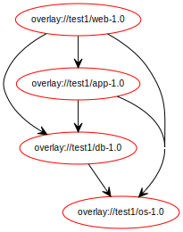
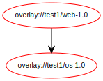

This is a Portage overlay in which each category contains a few ebuilds 
set up to example to test package manager behaviour. 

For each category "emerge -vp -e testX/web" to execute the test. 
 

###### Test case 1

This scenario defines the following runtime dependencies for "web"

This scenario defines the following compiletime dependencies for "web"

###### Test case 2

###### Test case 3

###### Test case 4

###### Test case 5

###### Test case 6

###### Test case 7

###### Test case 8
