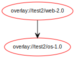
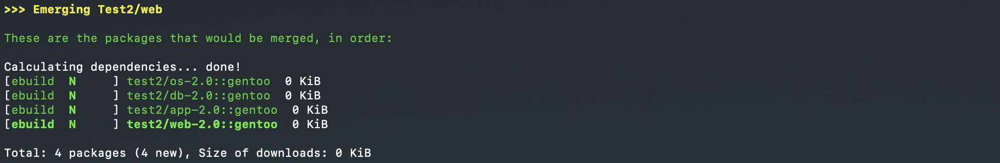
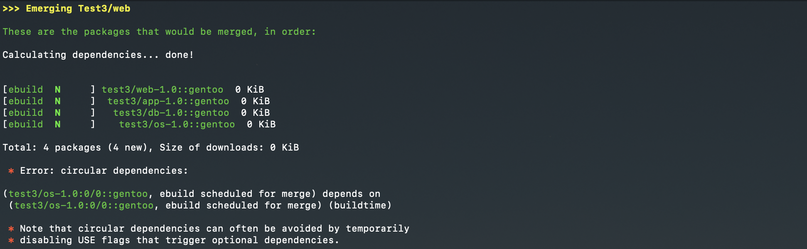
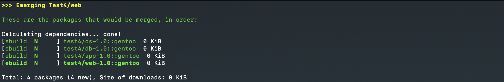
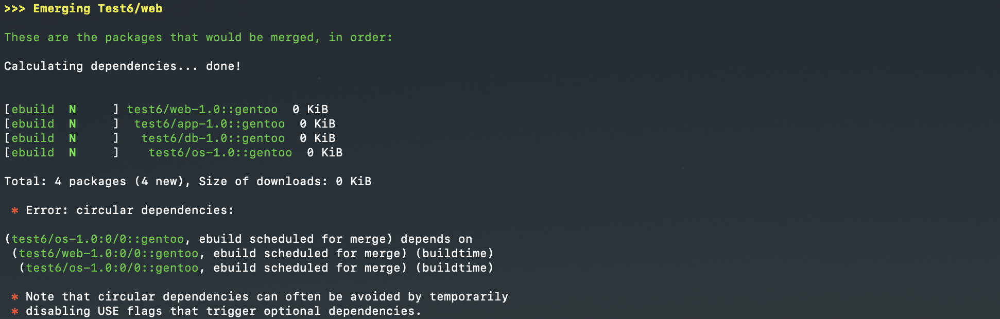
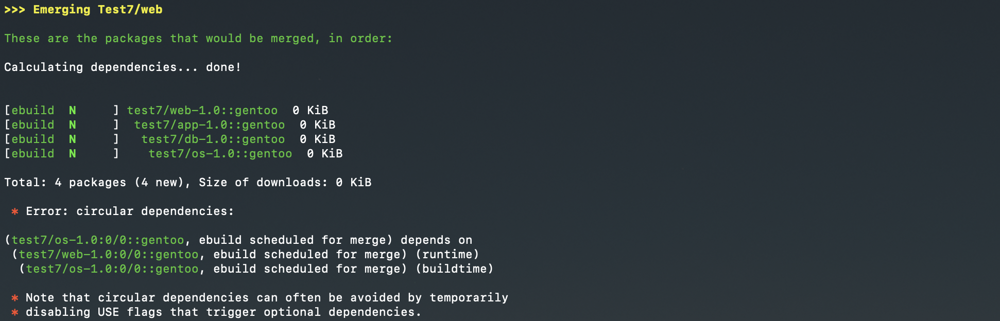
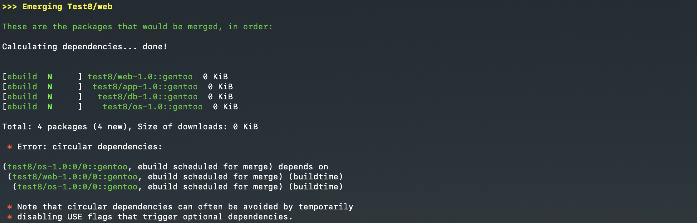

This is a Portage overlay in which each category contains a few ebuilds 
set up to example to test package manager behaviour. 

For each category "emerge -vp -e testX/web" to execute the test. 
 

## Test case 1 - Dependencies

This scenario defines the following runtime dependencies for "web"

This scenario defines the following compiletime dependencies for "web"

The result using Gentoo emerge: 

## Test case 2 - Versions

This scenario defines the following runtime dependencies for "web"

This scenario defines the following compiletime dependencies for "web"

The result using Gentoo emerge: 

## Test case 3 - Self-Dependency (compile) 

This scenario defines the following runtime dependencies for "web"

This scenario defines the following compiletime dependencies for "web"

The result using Gentoo emerge: 

## Test case 4 - Self-Dependency (run)

This scenario defines the following runtime dependencies for "web"

This scenario defines the following compiletime dependencies for "web"

The result using Gentoo emerge: 

## Test case 5 - Self-Dependency (compile & run)

This scenario defines the following runtime dependencies for "web"

This scenario defines the following compiletime dependencies for "web"

The result using Gentoo emerge: 

## Test case 6 - Circular dependency (compile)

This scenario defines the following runtime dependencies for "web"

This scenario defines the following compiletime dependencies for "web"

The result using Gentoo emerge: 

## Test case 7 - Circular dependency (run)

This scenario defines the following runtime dependencies for "web"

This scenario defines the following compiletime dependencies for "web"

The result using Gentoo emerge: 

## Test case 8 - Circular dependency (compile & run)

This scenario defines the following runtime dependencies for "web"

This scenario defines the following compiletime dependencies for "web"

The result using Gentoo emerge: 

