This is a Portage overlay in which each category contains a few ebuilds 
set up to example to test package manager behaviour. 

For each category "emerge -vp -e testX/web" to execute the test. 
 

## Test case 01 - Dependencies

This scenario defines the following runtime dependencies for "web"

This scenario defines the following compiletime dependencies for "web"

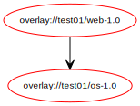

The result using Gentoo emerge: 

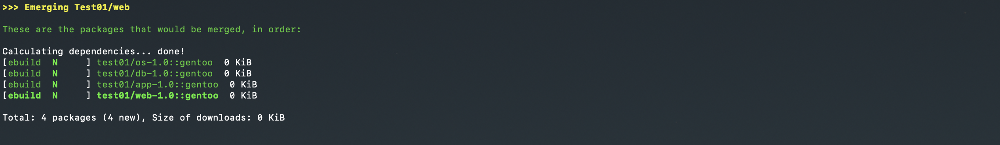

## Test case 02 - Versions

This scenario defines the following runtime dependencies for "web"

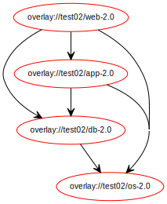

This scenario defines the following compiletime dependencies for "web"

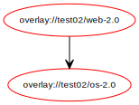

The result using Gentoo emerge: 

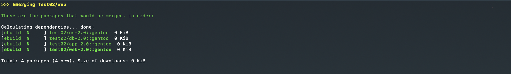

## Test case 03 - Self-Dependency (compile) 

This scenario defines the following runtime dependencies for "web"

This scenario defines the following compiletime dependencies for "web"

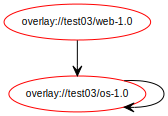

The result using Gentoo emerge: 

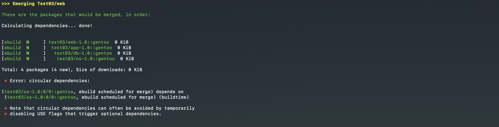

## Test case 04 - Self-Dependency (run)

This scenario defines the following runtime dependencies for "web"

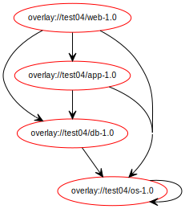

This scenario defines the following compiletime dependencies for "web"

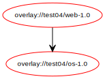

The result using Gentoo emerge: 

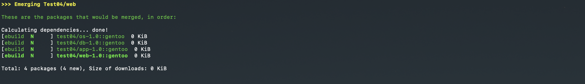

## Test case 05 - Self-Dependency (compile & run)

This scenario defines the following runtime dependencies for "web"

This scenario defines the following compiletime dependencies for "web"

The result using Gentoo emerge: 

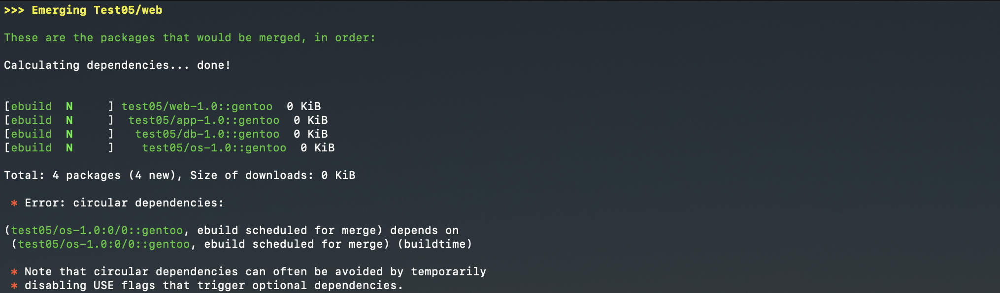

## Test case 06 - Circular dependency (compile)

This scenario defines the following runtime dependencies for "web"

This scenario defines the following compiletime dependencies for "web"

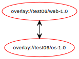

The result using Gentoo emerge: 

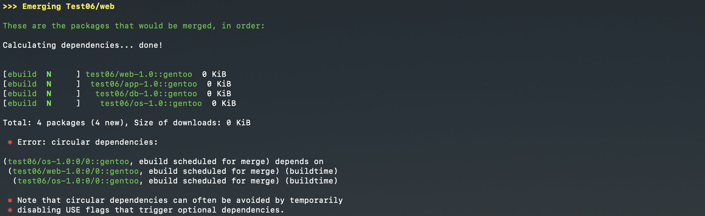

## Test case 07 - Circular dependency (run)

This scenario defines the following runtime dependencies for "web"

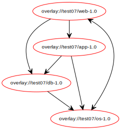

This scenario defines the following compiletime dependencies for "web"

The result using Gentoo emerge: 

## Test case 08 - Circular dependency (compile & run)

This scenario defines the following runtime dependencies for "web"

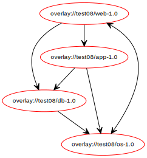

This scenario defines the following compiletime dependencies for "web"

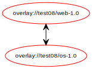

The result using Gentoo emerge: 

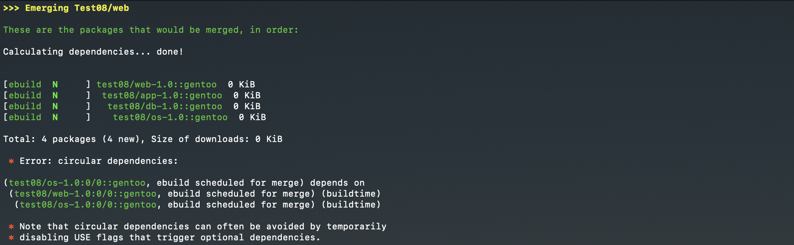

## Test case 09 - Dependency on non-existent package (compile)

This scenario defines the following runtime dependencies for "web"

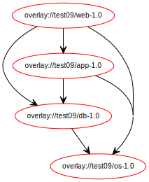

This scenario defines the following compiletime dependencies for "web"

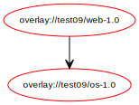

The unsatisfiable dependency:

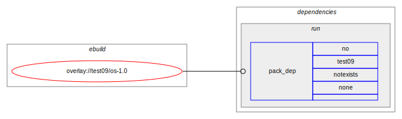

The result using Gentoo emerge: 

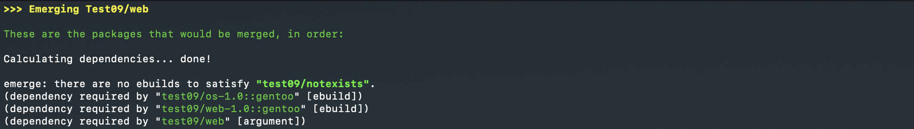

## Test case 10 - Dependency on non-existent package (run)

This scenario defines the following runtime dependencies for "web"

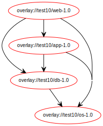

This scenario defines the following compiletime dependencies for "web"

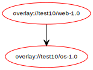

The unsatisfiable dependency:

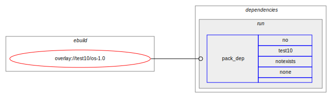

The result using Gentoo emerge: 

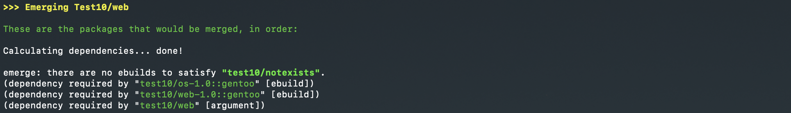

## Test case 11 - Dependency on non-existent package (compile & run)

This scenario defines the following runtime dependencies for "web"

This scenario defines the following compiletime dependencies for "web"

The unsatisfiable dependency:

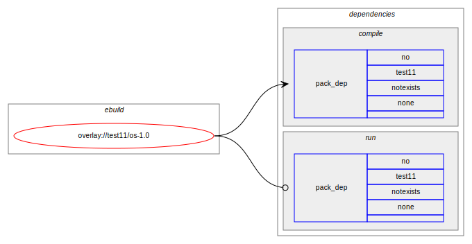

The result using Gentoo emerge: 

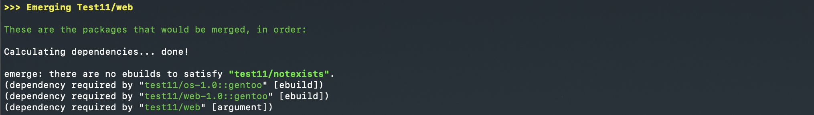

## Test case 12 - Accept keywords test case

This scenario defines the following runtime dependencies for "web"

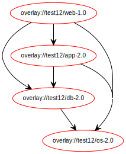

This scenario defines the following compiletime dependencies for "web"

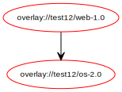

The result using Gentoo emerge: 

## Test case 13 - Pinpointed version dependency

 This scenario defines the following runtime dependencies for "web"

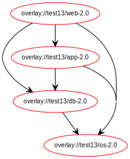

This scenario defines the following compiletime dependencies for "web"

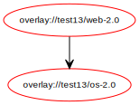

The result using Gentoo emerge: 

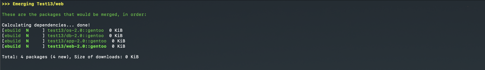

## Test case 14 - Positive use conditional dependency

This scenario defines the following runtime dependencies for "web"

This scenario defines the following compiletime dependencies for "web"

The use conditional dependency:

The result using Gentoo emerge: 

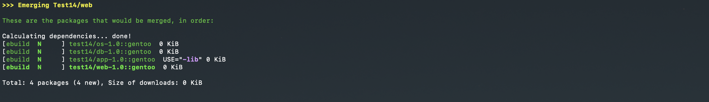

## Test case 15 - Negative use conditional dependency

This scenario defines the following runtime dependencies for "web"

This scenario defines the following compiletime dependencies for "web"

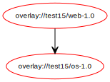

The use conditional dependency:

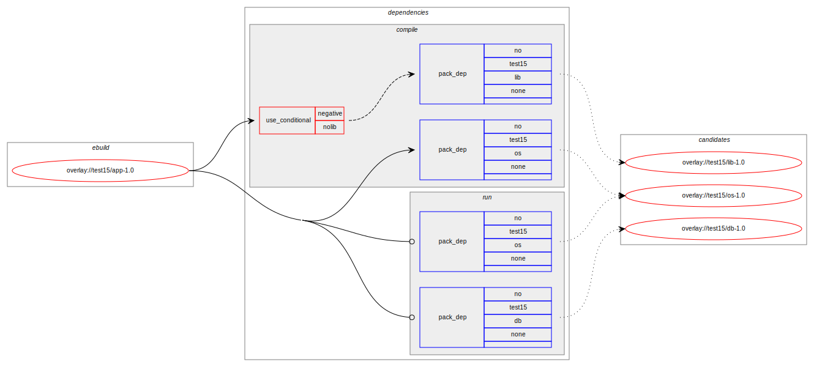

The result using Gentoo emerge: 

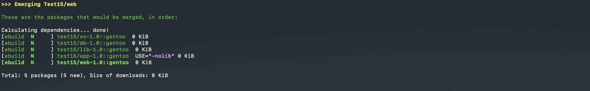

## Test case 16 - All-of-group dependency

This scenario defines the following runtime dependencies for "web"

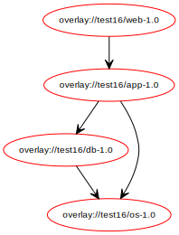

This scenario defines the following compiletime dependencies for "web"

The all-of-group dependency:

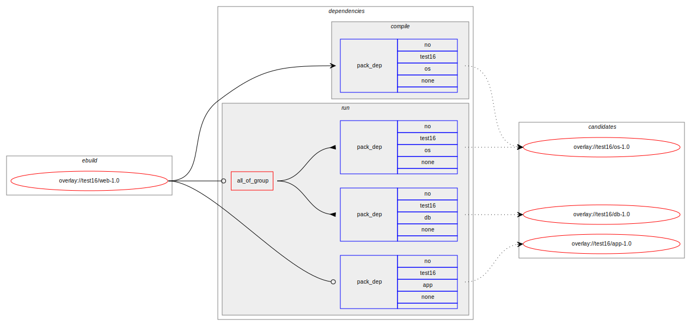

The result using Gentoo emerge: 

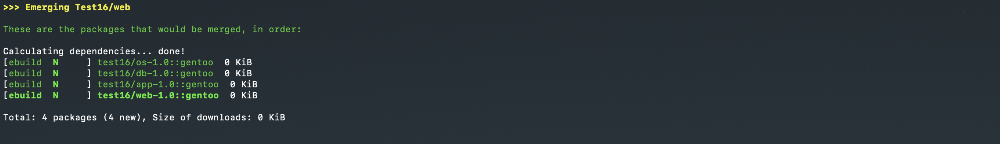

## Test case 17 - Exactly-one-of-group compile dependency

This scenario defines the following runtime dependencies for "web"

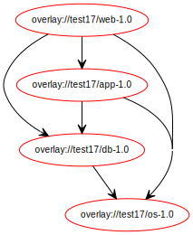

This scenario defines the following compiletime dependencies for "web"

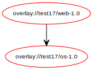

The exactly-one-of-group dependency:

The result using Gentoo emerge: 

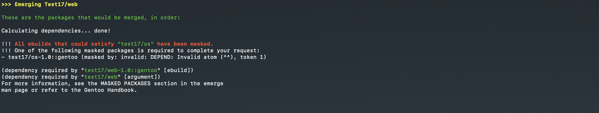

## Test case 18 - Exactly-one-of-group runtime dependency

This scenario defines the following runtime dependencies for "web"

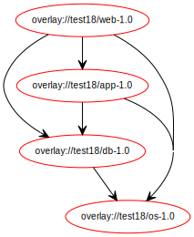

This scenario defines the following compiletime dependencies for "web"

The exactly-one-of-group dependency:

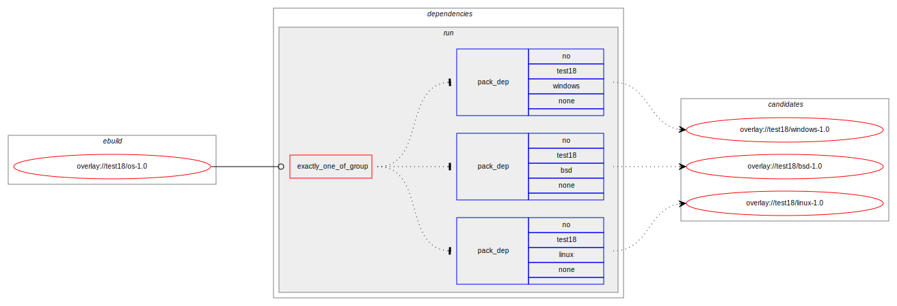

The result using Gentoo emerge: 

## Test case 19 - Exactly-one-of-group compile & runtime dependency

This scenario defines the following runtime dependencies for "web"

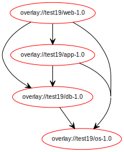

This scenario defines the following compiletime dependencies for "web"

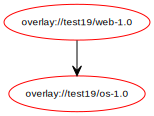

The exactly-one-of-group dependency:

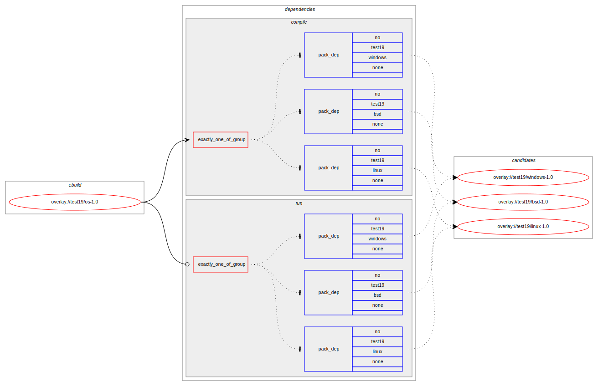

The result using Gentoo emerge: 

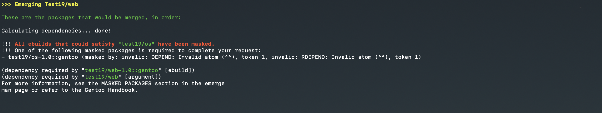

## Test case 20 - Any-of-group compile dependency

This scenario defines the following runtime dependencies for "web"

This scenario defines the following compiletime dependencies for "web"

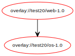

The exactly-one-of-group dependency:

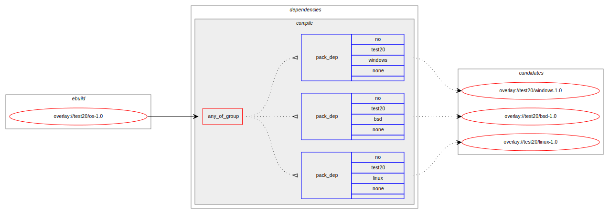

The result using Gentoo emerge: 

## Test case 21 - Any-of-group runtime dependency

This scenario defines the following runtime dependencies for "web"

This scenario defines the following compiletime dependencies for "web"

The exactly-one-of-group dependency:

The result using Gentoo emerge: 

## Test case 22 - Any-of-group compile & runtime dependency

This scenario defines the following runtime dependencies for "web"

This scenario defines the following compiletime dependencies for "web"

The exactly-one-of-group dependency:

The result using Gentoo emerge: 

## Test case 23 - compile dependency

This scenario defines the following runtime dependencies for "web"

This scenario defines the following compiletime dependencies for "web"

The exactly-one-of-group dependency:

The result using Gentoo emerge: 

